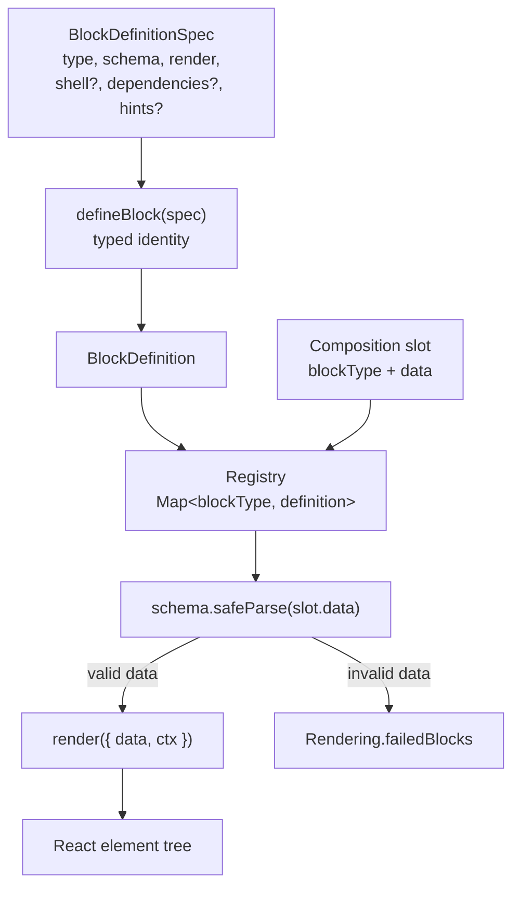
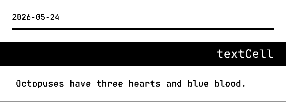
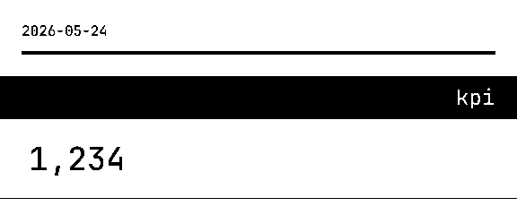

# Block

## Purpose

A **Block** is the atomic unit of printed content in pressedslip. It pairs a type
key, a Zod schema, and a render function into a single definition that the registry
can dispatch at render time. Blocks exist because the library needs a clean boundary
between "what the output looks like" (the block's responsibility) and "where the
data comes from" (the consumer's responsibility, per ADR-0012).

`defineBlock` is the typed factory that produces a `BlockDefinition` from a
`BlockDefinitionSpec` literal. It is an identity cast at runtime — its sole job is
to preserve the `TData` generic so TypeScript narrows the `render` function's `data`
parameter to the exact shape the schema validates against. Without `defineBlock` the
generic is widened to `unknown` at the call site, losing all schema-to-render type
linkage.

```
BlockDefinitionSpec<TData>  --defineBlock()-->  BlockDefinition<TData>
                                                      |
                                              registered in Registry
                                                      |
                                         dispatched by composeTree per slot
```

The seven builtin blocks (`textCell`, `keyValue`, `kpi`, `list`, `qaPair`,
`quotation`, `wordSearch`) cover the general-purpose visual-shape catalog. They
are domain-agnostic primitives. Content-source specifics (weather, jokes, meal
plans) belong in consumer-side definitions written with the same `defineBlock`
API.

---

## Canonical diagrams

### Block lifecycle



### Visual reference — textCell (canonical single-body text primitive)



### Visual reference — kpi (stat-card with value, label, caption)



---

## Invariants

The following invariants hold across all blocks, builtin and consumer-defined.
Violations indicate a bug in `composeTree` or in the block author's `defineBlock`
call, not in the caller of `render()`.

- **`render` always receives `{ data, ctx }`** regardless of whether the
  implementation destructures `ctx`. The signature is fixed by `BlockDefinitionSpec`;
  omitting `ctx` in destructuring is a stylistic choice, not a contract change.

- **`data` passed to `render` is always the output of a successful `schema.safeParse`**,
  never the raw slot data. `composeTree` calls `def.schema.safeParse(slot.data)`
  before invoking `def.render`; a failed parse records a `FailedBlock` and skips
  the slot entirely — `render` is never called with unvalidated data.

- **A block whose schema validation fails is recorded in `failedBlocks` and
  skipped — it never throws into the parent render.** The `onBlockError` policy
  controls side effects (log, throw, placeholder), but `failedBlocks` is populated
  unconditionally before any side-effect branch executes (ADR-0014).

- **An unknown block type is recorded in `failedBlocks` and skipped.**
  `registry.find(blockType)` returns `undefined`; the slot is appended to
  `failedBlocks` before the `onUnknownType` side-effect branch. The new block
  type's absence from the registry is the first thing to check when a block
  renders blank.

- **A block whose `render` function throws is recorded in `failedBlocks` and
  skipped** (default `onBlockError: "skip"` policy). The error is logged via
  `logger.error`; no exception propagates to the caller of `render()` unless
  `onBlockError: "throw"` is set explicitly.

- **A `render` function that returns `null` produces no output and no failure.**
  `composeTree` silently skips null-returning renders; the slot does not appear
  in `failedBlocks`. This is intentional for conditional block content.

- **`ctx.config` and `ctx.cache` are always `undefined` in the render-only
  flow.** They are populated only by the orchestrator. Block render functions
  must not rely on either field being present.

- **`BlockDefinition<TData>` is an alias for `BlockDefinitionSpec<TData>`.** There
  is no structural difference; `defineBlock` is purely a generic-narrowing helper
  and does not mutate the spec.

- **`hints` entries must be single-line strings.** `composeJsoncWithHints` normalizes
  newlines to spaces as defense-in-depth (ADR-0022), but block authors must keep
  each hint entry free of `\n` and `\r`.

---

## ADR cross-references

| ADR | Decision |
|-----|----------|
| [ADR-0012](../adrs/0012-visual-shape-block-taxonomy.md) | Builtin blocks are visual-shape primitives only; content-source blocks belong consumer-side. |
| [ADR-0014](../adrs/0014-error-handling-and-no-silent-failures.md) | `failedBlocks` is always populated; `onBlockError` / `onUnknownType` control side effects only. |
| [ADR-0011](../adrs/0011-public-api-shape.md) | Builtin blocks and `defineBlock` are exported individually from the package root; consumers can partial-override `builtinBlocks`. |
| [ADR-0022](../adrs/0022-blockdefinition-hints.md) | `BlockDefinition.hints` optional field; `composeJsoncWithHints` injects hints as `//` comments above each slot. |

---

## Code anchors

| Symbol | File |
|--------|------|
| `defineBlock` | `src/define-block.ts` |
| `BlockDefinitionSpec<TData>`, `BlockDefinition<TData>`, `RenderContext`, `BlockShellOptions` | `src/types.ts` |
| `composeTree` — schema validation, dispatch, failure recording | `src/pipeline/compose-tree.tsx` |
| `textCellBlock` | `src/blocks/text-cell.tsx` |
| `kpiBlock` | `src/blocks/kpi.tsx` |
| `listBlock` | `src/blocks/list.tsx` |
| `keyValueBlock` | `src/blocks/key-value.tsx` |
| `qaPairBlock` | `src/blocks/qa-pair.tsx` |
| `quotationBlock` | `src/blocks/quotation.tsx` |
| `wordSearchBlock` | `src/blocks/word-search.tsx` |

---

## Debugging a blank PNG from a new builtin block

Work through the following checks in order. Each maps to a specific invariant above.

1. **Registry** — confirm the block is passed to `createRegistry`. A type not in the
   registry produces an `onUnknownType` entry in `failedBlocks`, not a blank PNG.
   Check `Rendering.failedBlocks` first; an entry with `reason.message` starting
   `"Unknown block type:"` confirms the registration is missing.

2. **Schema** — confirm `slot.data` satisfies the block's Zod schema. A
   `safeParse` failure appends a `FailedBlock` with
   `reason.message: "Schema validation failed: …"` and skips the render call.
   Test the schema in isolation: `myBlock.schema.safeParse(slotData)`.

3. **`render` returns `null`** — a render function that returns `null` silently
   produces no output and no failure record. Add a `console.log` inside the render
   function to confirm it is called at all.

4. **`render` throws** — with `onBlockError: "skip"` (the default) a throwing render
   is caught, logged, and recorded in `failedBlocks`. Enable
   `onBlockError: "throw"` in development to surface the exception immediately, or
   check `failedBlocks` for an entry with a non-schema error message.

5. **Shell / font** — if the block appears in `blockElements` but the PNG is still
   blank, the content may be rendering white-on-white, or a required font weight
   (e.g. `fontWeight: 700`) is not loaded. Inspect the intermediate SVG by running
   the `dev-render` CLI with `--save-svg`.
