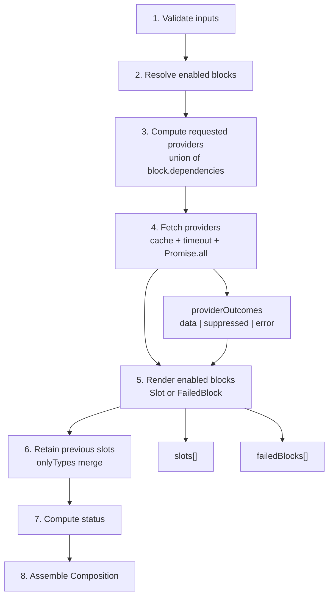

# compose() pipeline

## Purpose

`compose()` is the orchestrator entry point for `pressedslip`. It accepts a raw
`ComposeOptions` value — provider registry, block registry, date, context, cache
policy, and error mode — and returns a structurally-prepared `Composition` ready
for `render()`.

The pipeline is deterministic for a given set of inputs. All async work
(provider fetching) happens inside step 4. Steps 5–8 are synchronous. The
returned `Composition` is JSON-serializable by contract.

### Pipeline stages

| Step | Name | Outcome on failure |
|------|------|--------------------|
| 1 | **Validate inputs** | Throws (programmer error — precondition not met) |
| 2 | **Resolve enabled blocks** | Evaluates `isEnabled()` per block; disabled blocks are set aside |
| 3 | **Compute requested providers** | Union of `block.dependencies` across enabled blocks (scoped to `onlyTypes` when set) |
| 4 | **Fetch providers** | `Promise.all` — per-provider: cache lookup, `withTimeout`, error capture, `parallel-hard` abort detection |
| 5 | **Render enabled blocks** | Routes each block to `Slot` or `FailedBlock` based on step-4 outcomes |
| 6 | **Retain previous slots** | Re-merges `onlyTypes` partial renders with the prior `Composition` (M4 parity) |
| 7 | **Compute status** | Normative `_computeStatus` truth table — `"ready"`, `"partial"`, `"empty"`, or `"failed"` |
| 8 | **Assemble Composition** | Returns the final envelope with `slots`, `failedBlocks`, `providerOutcomes`, and timing |

**Programmer errors** (invalid options, undeclared dependencies, missing
`subjectId` for a personal-scoped provider) propagate out of `compose()` as
thrown `Error` instances. **Operational failures** (provider errors, timeouts,
render throws) are captured inside the returned `Composition` and never cause
`compose()` itself to reject.

---

## Canonical diagram



---

## Invariants

The invariants below are backed by specific code paths in
`src/orchestrator/compose.ts`. They are not aspirational.

### I1 — Blocks with failed providers land in `failedBlocks`, not silently dropped

This is the invariant that makes the bug scenario ("compose silently drops a
block when a provider fails") impossible.

In step 5, `renderEnabledBlocks()` iterates every enabled block and checks
each declared dependency against the `providerOutcomes` map built in step 4.
The exact code path (lines 313–326 of `src/orchestrator/compose.ts`):

```ts
const erroredDep = deps.find((d) => args.providerOutcomes[d]?.ok === "error");
if (erroredDep !== undefined) {
  failedBlocks.push({
    index,
    blockType: block.type,
    reason: args.providerOutcomes[erroredDep]?.reason!,
    failedProvider: erroredDep,
  });
  counters.failCount++;
  return;
}
```

A block is pushed to `failedBlocks` with the provider's serialized error reason
and with `failedProvider` set to the provider key. The block does not reach
the `slots` array. There is no code path that can silently discard a block
when its provider fails — `failedBlocks.push(...)` is the only exit branch for
an errored-provider block, and the counter increment is unconditional.

The `failedBlocks` array is then returned directly as
`Composition.failedBlocks` in step 8.

### FailedBlock shape for provider failures

When a block lands in `failedBlocks` due to a provider error:

```ts
type FailedBlock = {
  readonly index: number;         // ordinal position in the enabled block list
  readonly blockType: string;     // block's type string
  readonly reason: _SerializableError; // { name: string; message: string; stack?: string }
                                  // copied from the provider's ProviderOutcome.reason
  readonly failedProvider?: string; // the provider key that returned { ok: "error" }
                                    // always set for provider failures
};
```

`reason` is the serialized form of whatever error the provider returned or
threw. For a timeout it is `{ name: "TimeoutError", message: "provider:key
timed out after Nms" }`. For a runtime throw it is the serialized `Error`.
`failedProvider` is always present on provider-induced `FailedBlock` entries;
it is absent only on render-phase failures and `HardModeAbort` entries (where
the cause is not a single provider).

### I2 — `parallel-soft` mode: one provider failure does not abort other blocks

In the default `"parallel-soft"` mode, `fetchProviders()` always completes the
full `Promise.all`. A provider that returns `{ ok: "error" }` does not prevent
other providers from completing. Blocks that depend on the failed provider land
in `failedBlocks`; blocks whose dependencies all succeeded produce `Slot`
entries. The full audit trail is in `Composition.providerOutcomes`.

### I3 — `parallel-hard` mode: any provider error aborts all blocks

When `mode: "parallel-hard"` and any provider returns `{ ok: "error" }`,
`hardAbort` is set to `true` in `fetchProviders()`. The hard-abort branch in
`renderEnabledBlocks()` fires first and routes every enabled block to
`failedBlocks` with `reason.name === "HardModeAbort"`. This applies even to
blocks whose own dependencies succeeded. The originating provider key is
recorded in each entry's `failedProvider` field.

### I4 — Provider timeout produces `{ ok: "error" }`, not a stale value

When `provider.fetch()` exceeds its timeout, `withTimeout` rejects with a
`TimeoutError`. Inside `fetchProviders()`:

```ts
} catch (thrown) {
  if (isProgrammerError(thrown)) throw thrown;
  result = { ok: "error", reason: toSerializableError(thrown as Error) };
}
```

`TimeoutError` is not a programmer error, so it is converted to
`{ ok: "error", reason: { name: "TimeoutError", ... } }`. The cache-write
guard `if (result.ok === "data" && cacheKey !== null)` is never reached —
the cache is not written on timeout. The `providerData` map only receives an
entry when `result.ok === "data"`. Blocks downstream of a timed-out provider
find no entry in `providerData` and are routed to `failedBlocks` via the I1
path above.

### I5 — Programmer errors in providers re-throw past `compose()`

Inside `fetchProviders()`, only errors that pass `isProgrammerError(thrown)`
are re-thrown. All other thrown values are converted to
`{ ok: "error", reason }` and handled as operational failures. This means
logic errors (null pointer, assertion failure) surface immediately in
development; network errors, timeouts, and data-shape failures are captured.

### I6 — `failedBlocks` is always present; empty when no failures occurred

`Composition.failedBlocks` is a required field typed `FailedBlock[]`. Step 8
always assigns it from `renderResult.failedBlocks`. When every block succeeds,
the array is `[]` — not `undefined` and not omitted. This follows the
always-record invariant established in ADR-0014.

---

## `composeJsoncWithHints`

`composeJsoncWithHints` is a separate public helper defined in
`src/compose-jsonc.ts`. It is not part of the 8-step `compose()` pipeline.

### What it does

`composeJsoncWithHints(composition, registry)` accepts a minimal
`JsoncCompositionInput` (an object with `date`, optional `subject`, `meta`,
and `slots`) and a block `Registry`, and returns a JSONC string. For each
slot in the input, it looks up the corresponding block definition via
`registry.find(slot.blockType)` and prepends any `BlockDefinition.hints`
entries as `//` line comments above the slot's JSON object.

```ts
import { composeJsoncWithHints, createRegistry, builtinBlocks } from "pressedslip";

const registry = createRegistry(builtinBlocks);
const jsonc = composeJsoncWithHints(
  {
    date: "2026-01-15",
    meta: {},
    slots: [{ blockType: "kpi", data: { value: "42" } }],
  },
  registry,
);
// Output includes:
//   // Required: ...
//   // Values of ...
//   { "blockType": "kpi", "data": { "value": "42" } }
```

### How it differs from `compose()`

`compose()` is an async orchestrator: it fetches provider data, resolves
block enablement, and builds a `Composition` from live runtime state.
`composeJsoncWithHints` is a synchronous emitter: it accepts a
composition-shaped value that already exists (e.g., produced by a prior
`compose()` call, loaded from storage, or hand-written by a developer) and
serialises it to an annotated JSONC string. It performs no fetching, no
provider resolution, and no status computation.

The two functions operate at different points in a typical workflow:

1. `compose()` — runtime, async, produces a `Composition`
2. `composeJsoncWithHints` — serialisation, sync, produces a human-readable
   JSONC string from an existing composition-shaped value

### Why it exists

The playground's JSONC editing pane needs to regenerate its text display on
every builder mutation (insert/delete/reorder a slot). When regeneration uses
plain `JSON.stringify`, all `//` comments are lost. `composeJsoncWithHints`
is the canonical-fallback emitter: any time the JSONC text is rebuilt from
scratch, block hints reappear automatically because they come from the block
registry, not from the stored text.

The same helper is available to server-side consumers who want readable diffs
in stored briefings or during debugging — the function is exported from the
package root, not locked to the playground.

Each hint line is pulled from `BlockDefinition.hints?: readonly string[]`,
an additive optional field on the block definition spec. Custom blocks
without hints emit no comments; the helper degrades safely. Newlines within a
hint string are collapsed to spaces by `normalizeHintLine()` as runtime
defense-in-depth (ADR-0022 §Type-level guarantees not provided).

Round-trip invariant: `parseJsonc(composeJsoncWithHints(input, registry))`
is structurally equal to `input` for any JSON-serializable input — the
comments are stripped by `parseJsonc` and have no effect on the data.

See `src/compose-jsonc.ts` for the full implementation (~55 lines, no
external dependency on a JSONC writer library — see ADR-0022 for the
rationale).

---

## ADR cross-references

| ADR | Relevance to this document |
|-----|---------------------------|
| [ADR-0014](../adrs/0014-error-handling-and-no-silent-failures.md) | Establishes the "mode + always-record" principle. `Composition.failedBlocks` is a required field; failure records are never silently dropped regardless of error mode. The no-silent-drop invariant (I1 above) is the compose-layer enforcement of this rule. |
| [ADR-0022](../adrs/0022-blockdefinition-hints.md) | Defines `BlockDefinition.hints` and `composeJsoncWithHints`. Documents the four-prefix hint convention (`Required:`, `Values of`, `Tip:`, `Docs:`), the `normalizeHintLine` defense, and the rationale for hand-rolled JSONC emission over `jsonc-parser.modify`. |
| [ADR-0008](../adrs/0008-quality-bar-never-rules.md) | "No silent failures" quality rule that motivated always-record. Provider errors and render throws surface in `failedBlocks`; no block is dropped with no signal. |
| Bounded-hybrid migration strategy | The bounded-hybrid migration strategy adopted during extraction drives the M4 parity obligation behind the `retainPreviousSlots` step (step 6). |
| [ADR-0011](../adrs/0011-public-api-shape.md) | Public API shape; `compose()`, `Composition`, `FailedBlock`, `ProviderOutcome`, and `composeJsoncWithHints` are all part of the public surface. |

---

## Code anchors

### `src/orchestrator/compose.ts:compose`

The 8-step pipeline entry point. Key sub-functions:

- `validateInputs()` (step 1) — synchronous programmer-error checks before any side effects.
- `resolveEnabled()` (step 2) — evaluates `isEnabled()` per block using the enablement PRNG.
- `computeRequestedProviders()` (step 3) — dependency union across enabled blocks; exported for testing.
- `fetchProviders()` (step 4) — `Promise.all` dispatch, cache read/write, `withTimeout` wrapper, error capture, hard-abort detection; exported for testing.
- `renderEnabledBlocks()` (step 5) — routes each block to `Slot` or `FailedBlock` based on the outcomes map; exported for testing. The no-silent-drop code path is at the `erroredDep` check inside this function.
- `retainPreviousSlots()` (step 6) — re-merges partial renders with a prior composition by block type, not ordinal index; exported for testing.
- `_computeStatus()` (step 7) — normative truth table in `src/orchestrator/compute-status.ts`.

For the bug scenario ("provider fails, block dropped silently"): read
`renderEnabledBlocks()` at the `erroredDep` check. A block with a failed
dependency is unconditionally pushed to `failedBlocks` with the provider's
`reason` and `failedProvider` key. There is no code path that skips this
push and returns without recording.

### `src/compose-jsonc.ts:composeJsoncWithHints`

Synchronous JSONC emitter. Accepts `JsoncCompositionInput` and a `Registry`.
Iterates `composition.slots`, calls `registry.find(slot.blockType)` for each
slot, and prepends `def.hints` entries as `// <hint>` lines. `normalizeHintLine()`
collapses internal newlines. `reindent()` handles multi-line slot JSON blocks.
No runtime dependency on a JSONC parser or writer.

---

## See also

- [Provider subsystem](./provider.md) — covers steps 3–5 from the provider
  perspective: cache key derivation, timeout behavior, and the I4 invariant
  (timeout produces `"error"`, not a stale value).
- [TSDoc style guide](./tsdoc-style.md) — conventions for all public symbols,
  including `compose()` and `composeJsoncWithHints`.
