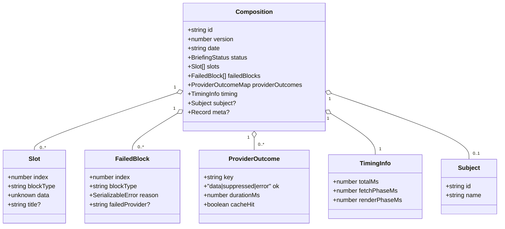

# Composition

## Purpose

A `Composition` is the serializable envelope that `compose()` produces and `render()` consumes. It captures the full orchestration outcome for one briefing run: the ordered array of data-bearing slots ready for rendering, the list of blocks that could not produce a slot, per-provider fetch outcomes, wall-clock timing, and a five-state status summary. Because `Composition` is JSON-serializable by contract, it can be stored, replayed, or forwarded to a transport without any further processing. The render pipeline treats it as read-only input — it never mutates a `Composition` in place. This clean boundary means the orchestration layer (`compose()`) and the render layer (`render()`) are independently testable and independently deployable: you can store a `Composition` today and render it tomorrow with a newer version of the package.

---

## Canonical diagram

Structural overview of the `Composition` envelope and the two functions that produce and consume it:

Rendered example of a briefing built from a stored `Composition`:

---

## Invariants

The implementation must preserve all of the following properties. Any fix that would violate one of these is a breaking change.

- **Slot order is registry order.** `composition.slots[N]` corresponds to the Nth enabled block in registry order at compose time. The render pipeline walks `slots` sequentially and emits blocks top-to-bottom in that order. Re-sorting slots before calling `render()` reorders rendered output.

- **`slot.index` equals the block's position in `enabledBlocks` at compose time.** `index` is the 0-based offset into the enabled-block list, not the offset in the full registry. It is set once in `renderEnabledBlocks` and never re-derived.

- **Slot array contains only successfully composed blocks.** A block that fails at provider fetch, provider suppression (for hard-abort mode), or render-phase throw does not appear in `slots`. It appears in `failedBlocks` instead. The two arrays are disjoint.

- **`failedBlocks` is always present and always complete, regardless of error mode.** `onUnknownType` and `onBlockError` control side effects (logging, throwing) but never suppress entries from `failedBlocks`. An empty array means zero failures; the field is never absent. (ADR-0014.)

- **`Composition` is JSON-serializable.** Every value within `slots[].data`, `failedBlocks[].reason`, `providerOutcomes`, and `meta` must round-trip through `JSON.stringify` / `JSON.parse` without loss. `undefined`-valued object properties are dropped per `JSON.stringify` semantics.

- **`version` is an independent axis from the package semver.** `Composition.version` is bumped only when a stored payload produced by an older version of the package can no longer be rendered by a newer version without a migration step. A breaking package-API change does not automatically bump `version`. (See [versioning.md](./versioning.md) §3.)

- **`status` is derived, not asserted.** `status` is the output of the `_computeStatus` truth table applied to the counters from the compose run. It is never set directly to an arbitrary string. The five valid values are `"pending"` (consumer-only, never returned by `compose()`), `"ready"`, `"partial"`, `"failed"`, and `"render-failed"`.

- **Partial re-render (`onlyTypes`) merges by block type, not by ordinal index.** When `onlyTypes` is set, `retainPreviousSlots` keys retained slots by `blockType`, not by `slot.index`. This means a registry reordering between two compose runs does not corrupt retained slots; the retained slot's `index` is overwritten to the current registry position.

- **`slot.title` is carried verbatim from compose time.** The render shell uses `slot.title` when present. `title` is not re-derived from the block definition at render time; whatever `title` value was set during the compose run is the value `render()` will use.

- **`slots` is `readonly`.** The type declares `slots: readonly Slot[]` and each `Slot` field is `readonly`. Neither `render()` nor `composeTree()` mutates slots in place.

- **Counters sum invariant.** At status-computation time: `okCount + failCount + suppressedCount + renderFailCount ≤ enabledCount`. `_computeStatus` throws a programmer error if this is violated.

---

## ADR cross-references

| ADR | Relevance |
|---|---|
| Bounded-hybrid migration strategy | The bounded-hybrid migration strategy adopted during extraction establishes that `Composition` must support a replay harness (M4, M7 parity obligations) without requiring the orchestrator to be live. |
| [ADR-0011: Public API shape](../adrs/0011-public-api-shape.md) | Lists `Composition` as a named public export from the root barrel; governs its place in the public surface. |
| [ADR-0012: Block taxonomy — visual shapes, not content sources](../adrs/0012-visual-shape-block-taxonomy.md) | Explains why `slots[].data` is typed `unknown` rather than a domain-specific type: the library owns visual shapes; consumers own content. |
| [ADR-0014: Error handling and no-silent-failures](../adrs/0014-error-handling-and-no-silent-failures.md) | Mandates that `failedBlocks` is always present and always complete. Governs the `onUnknownType` and `onBlockError` mode semantics. |
| [ADR-0022: BlockDefinition.hints + composeJsoncWithHints](../adrs/0022-blockdefinition-hints.md) | Introduces `composeJsoncWithHints()`, which consumes a `Composition`-compatible shape (`JsoncCompositionInput`) to produce annotated JSONC output. |

---

## Code anchors

The symbols below are the entry points for reading and modifying the Composition subsystem. Open them in this order when tracing a "new slot doesn't render" bug.

| Symbol | File | Description |
|---|---|---|
| `Composition` | `src/types.ts` | Authoritative type definition. The canonical shape: `id`, `version`, `date`, `status`, `slots`, `failedBlocks`, `providerOutcomes`, `timing`. |
| `Slot` | `src/types.ts` | One entry in `composition.slots`. Fields: `index`, `blockType`, `data`, `title`. |
| `FailedBlock` | `src/types.ts` | Diagnostic record for a block that did not produce a slot. Always populated; never absent. |
| `compose` | `src/orchestrator/compose.ts` | Entry point for the 8-step orchestration pipeline. Returns a `Composition`. Programmer errors throw; operational failures land in `failedBlocks`. |
| `renderEnabledBlocks` | `src/orchestrator/compose.ts` | Step 5 of the pipeline. Routes each enabled block to a `Slot` or a `FailedBlock`. This is where a new block's slot is created (`slots.push({ index, blockType, data })`). |
| `retainPreviousSlots` | `src/orchestrator/compose.ts` | Step 6. Merges freshly-rendered slots with retained slots from a `previousComposition` when `onlyTypes` is set. Keyed by `blockType`, not by ordinal. |
| `_computeStatus` | `src/orchestrator/compute-status.ts` | Pure function. Applies the R1–R9 truth table to counters from the compose run to derive `BriefingStatus`. |
| `computeBriefingStatus` | `src/orchestrator/compute-status.ts` | Public helper. Re-derives status from a completed `Composition`; useful after consumer mutations. |
| `composeTree` | `src/pipeline/compose-tree.tsx` | Render-side consumer of `Composition`. Walks `composition.slots`, validates each slot's data against its registered schema, calls `def.render()`, and wraps output in `BlockShell`. Produces the React element tree passed to Satori. |
| `render` | `src/render.tsx` | Top-level render entry point. Calls `composeTree` then drives the Satori → resvg → 1-bit → PNG pipeline. |
| `JsoncCompositionInput` | `src/types.ts` | Minimal structural subset of `Composition` accepted by `composeJsoncWithHints()`. |

---

## Cold-read: "new slot doesn't render even though the data is correct"

If a slot carries correct data but nothing appears in the rendered PNG, trace in this order:

1. **Is the slot in `composition.slots`?** Check `composition.slots` length and inspect whether the new block type appears. If it is absent, the failure is in the compose pipeline — open `src/orchestrator/compose.ts` at `renderEnabledBlocks` (step 5). Look at whether the block's provider dependency errored or was suppressed (`providerOutcomes`), or whether a render-phase throw was caught and routed to `failedBlocks`.

2. **Is the block type registered?** `composeTree` (in `src/pipeline/compose-tree.tsx`) calls `registry.find(blockType)` for each slot. If `find` returns `undefined`, the slot is recorded in `failedBlocks` with `"Unknown block type"` and skipped. Verify the block definition was passed to `createRegistry`.

3. **Does the slot's data pass schema validation?** `composeTree` calls `def.schema.safeParse(data)` before calling `def.render`. A validation failure records a `FailedBlock` and skips the slot regardless of `onBlockError` mode. Inspect `rendering.failedBlocks` (from the `Rendering` returned by `render()`), not only `composition.failedBlocks` (from `compose()`).

4. **Does `def.render` return `null`?** In `composeTree`, a `null` return from `def.render` is silently skipped (`if (inner === null) continue`). No `FailedBlock` is recorded. If the block's render function intentionally returns `null` for certain data shapes, the slot will be absent from the output without any failure entry.

The invariants in the section above constrain any fix: in particular, adding a slot must not skip step 2 (registry lookup) or step 3 (schema validation), and any failure must land in `failedBlocks` regardless of the `onBlockError` policy.
