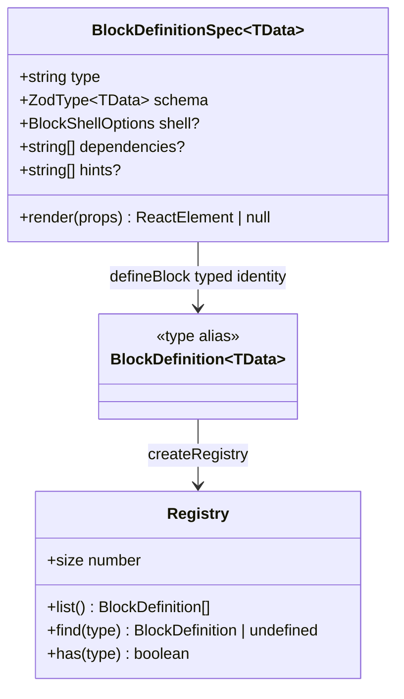

# `defineBlock` API

## Purpose

`defineBlock<TData>` is the single factory through which every block definition
enters the `pressedslip` pipeline — both the seven visual-shape builtins shipped
by the package and any custom blocks written by consumers. There is no second
path. A block that is not created through `defineBlock` cannot be registered,
and therefore cannot be rendered.

The function is a typed identity cast: it accepts a `BlockDefinitionSpec<TData>`
literal and returns it unchanged as a `BlockDefinition<TData>`. The value
returned at runtime is exactly the value passed in. The work `defineBlock` does
is entirely at the type-system level: it forces TypeScript to infer `TData` from
the `schema` field (a `ZodType<TData>`) and then propagate that same `TData`
into the `render` function's `data` parameter. Without the explicit factory,
TypeScript has no opportunity to capture and link the generic across those two
fields in an object literal.

The consequence for the caller: once a block is created with `defineBlock`, the
`data` argument available inside `render` is typed as the *Zod output* of the
provided schema — already parsed, coerced, and default-filled. The renderer
never receives raw, unvalidated input.

Builtins and consumer-defined blocks pass through the same `defineBlock` call.
There is no special handling, no internal registry, and no implicit registration
at definition time. Registration happens explicitly and separately through
`createRegistry`.

## Canonical diagram



The diagram shows the fields a caller provides: `type` (dispatch key), `schema`
(validation shape), `render` (React element factory), and optional shell,
provider-dependency, and hint metadata. Provider fetching lives in
`compose()`/providers, not in `defineBlock`.

## Invariants

The following invariants hold unconditionally across all blocks — builtin and
custom — and must be preserved in any patch touching block definitions or the
render pipeline.

**Type narrowing via `ZodType<TData>`**

`BlockDefinitionSpec.schema` is typed as `ZodType<TData>`, which is
parameterised on the Zod *output* type only. TypeScript infers `TData` from the
schema's output type at the `defineBlock` call site. This means:

- The `render` function's `data` parameter has the exact type produced by Zod's
  `parse` / `safeParse`, not the raw input type.
- If the schema includes `.default()` transforms, `TData` reflects the
  post-default type (e.g., `z.enum(["C","F"]).default("C")` yields
  `"C" | "F"` in `TData`, never `undefined`).
- The renderer can unconditionally access optional-but-defaulted fields without
  null checks. `data.size` is always `"small" | "large"`; it is never
  `undefined` even when the caller omitted the field.

If a schema uses both `.optional()` and `.default()`, `ZodType<TData>` may not
accept it without an explicit type parameter on older Zod 3.x versions. In
those cases, annotate: `schema: blockSchema as ZodType<OutputShape>`. All Zod
3.x releases from 3.22+ resolve this correctly without the cast.

**Render signature is always `{ data: TData; ctx: RenderContext }`**

The orchestrator always calls `render` with exactly two properties: the
validated `data` and the `ctx` (render context). No other properties are ever
injected. Consumers may safely destructure `{ data }` alone when `ctx` is not
needed; both destructuring patterns are valid:

```ts
// ctx unused — destructure only data
render: ({ data }) => <div>{data.label}</div>

// ctx used — destructure both
render: ({ data, ctx }) => {
  ctx.logger.debug("rendering", { type: ctx.block.type });
  return <div>{data.label}</div>;
}
```

Omitting `ctx` from the destructure does not affect the call — the orchestrator
passes it regardless.

**Validation is at render time, not at compose time**

The orchestrator calls `schema.safeParse(slot.data)` inside `render()`, just
before invoking the block's `render` function. At the point `render` is called,
`data` is always the successfully-parsed Zod output. Slots that fail validation
are dropped without throwing; they appear in `result.failedBlocks` as
`{ index, blockType, reason: { name, message } }`. The renderer is never invoked
for a failed slot.

**Builtins and custom blocks share one code path**

`textCellBlock`, `keyValueBlock`, `kpiBlock`, `listBlock`, `qaPairBlock`,
`quotationBlock`, and `wordSearchBlock` are all produced by calling
`defineBlock` with the same function signature as a consumer custom block. The pipeline has no
`if (isBuiltin)` branch. If the render pipeline behaves differently for a
builtin versus a custom block, that is a bug.

**`hints` is documentation, not a type constraint**

The optional `hints?: readonly string[]` field on `BlockDefinitionSpec` is
purely informational. It surfaces as `// comment` lines in JSONC output via
`composeJsoncWithHints()`. It has no effect on schema validation, render
dispatch, or type inference. A block with no `hints` array is structurally
identical to one with hints — only the JSONC playground experience differs.

**`type` is the registry dispatch key**

`BlockDefinitionSpec.type` is a plain `string`. The registry stores definitions
in a `Map<string, BlockDefinition>`. Two blocks with the same `type` cannot
coexist in one `Registry` instance — `createRegistry` throws at construction
time on duplicate `type` values. This is enforced at the `createRegistry` call,
not inside `defineBlock` itself.

## ADR cross-references

| ADR | Relevance |
|-----|-----------|
| [ADR-0010 — Naming conventions](../adrs/0010-naming-conventions.md) | Establishes `defineBlock` as the canonical verb-function name for the typed factory; reserves `compose` for the orchestrator. |
| [ADR-0011 — Public API shape](../adrs/0011-public-api-shape.md) | Places `defineBlock`, `BlockDefinition`, and `BlockDefinitionSpec` in the 25-export root surface; records why the root-only entry was chosen over day-1 subpath splits. |
| [ADR-0012 — Block taxonomy](../adrs/0012-visual-shape-block-taxonomy.md) | Establishes the visual-shape-only builtin policy and explains why content-source blocks (weather, dad jokes, meals) belong consumer-side as `defineBlock` definitions, not as builtins. |
| [ADR-0022 — `BlockDefinition.hints`](../adrs/0022-blockdefinition-hints.md) | Adds the optional `hints` field to `BlockDefinitionSpec`; records why Zod-derived hints and strict single-line enforcement were rejected in v1. |

## Code anchors

**Factory definition**

```
src/define-block.ts — defineBlock<TData>()
```

The entire implementation is a single typed identity return. The `TData`
generic is inferred from `BlockDefinitionSpec<TData>` at the call site.

**Type definitions**

```
src/types.ts — BlockDefinitionSpec<TData>, BlockDefinition<TData>, AnyBlockDefinition
```

`BlockDefinitionSpec<TData>` is the spec shape (what you pass in).
`BlockDefinition<TData>` is a type alias for the same shape with a default
`TData = unknown`, used for unparameterised storage in the registry map.
`AnyBlockDefinition` is `BlockDefinition<any>`, used where heterogeneous
`TData` blocks are collected into arrays (e.g., `createRegistry` input).

**Builtin block examples**

All seven builtins follow the same `defineBlock` call pattern. Use these as
reference when debugging type inference issues:

- `src/blocks/text-cell.tsx` — simplest builtin; no `.default()` in schema,
  optional fields use `.optional()`, explicit `ZodType<Output>` annotation
  shown with a comment explaining when the annotation is needed.
- `src/blocks/key-value.tsx` — illustrates a schema with structured object
  fields and an array type.
- `src/blocks/kpi.tsx` — illustrates enum fields and a numeric value.
- `src/blocks/list.tsx` — illustrates grouped list data.
- `src/blocks/qa-pair.tsx` — illustrates a two-field string schema.
- `src/blocks/quotation.tsx` — illustrates optional fields with a fallback
  applied at render time (not via `.default()`).
- `src/blocks/word-search.tsx` — illustrates fixed-grid render data where the
  caller supplies the puzzle content.

**Consumer walkthrough anchor**

`docs/guide/custom-block-walkthrough.md` — the "Validators with Defaults"
section (near the bottom) is the canonical reference for the `ZodType<TData>`
output-narrowing behavior, including when to use `as const` at the call site
and when to cast the schema explicitly.

---

> The function signature is stable in the current public API. Any change to
> `BlockDefinitionSpec` fields requires a new ADR that supersedes or extends
> ADR-0011.
