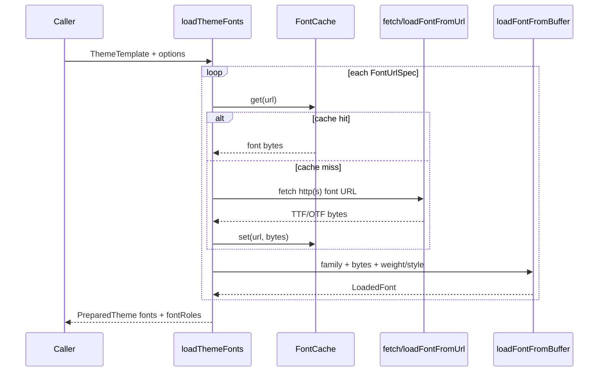

# Font Loading

## Purpose

The font-loading subsystem is responsible for acquiring raw TTF/OTF font bytes and assembling them into the `LoadedFont` (aliased as `FontSpec`) objects that Satori consumes during rendering. Every font that appears on a rendered output must pass through this subsystem; there is no other entry point for font data.

### Why fetch-only (ADR-0017)

In an earlier revision, `loadFontFromUrl` supported both `http(s)://` and `file://` URLs via `node:fs/promises` and `node:url` imports inside `src/fonts.ts`. Those imports made the file impossible to include in browser bundles — the browser-bundle purity gate (`scripts/verify-browser-bundle.mjs`) had to exclude `dist/index.mjs` as a workaround. ADR-0017 removed `file://` support and eliminated all `node:*` imports from `src/fonts.ts`, making both loaders fully browser-safe. The decision is a hard break: `loadFontFromUrl` now accepts only `http://` or `https://` URLs. Passing any other scheme propagates fetch's native `TypeError`. For Node callers that need local font files, the pattern is: read bytes via `node:fs/promises` `readFile`, then pass the buffer to `loadFontFromBuffer`.

### Font roles and theme-to-font mapping

A theme declares fonts through two registries in its `ThemeTemplate`:

- `roleUrls`: a record keyed by `FontRole` (`"body"`, `"display"`, `"mono"`). Each key maps to one or more `FontUrlSpec` entries, one per weight/style variant.
- `extraUrls`: an optional record for arbitrary custom role IDs not covered by the three canonical roles.

A `FontUrlSpec` carries four fields: `family` (the name Satori uses), `url`, `weight`, and `style`. These four fields are the declaration-side contract.

`loadThemeFonts` resolves every `FontUrlSpec` in both registries into a flat `fonts: FontSpec[]` array on the resulting `PreparedTheme`, and also preserves a `fontRoles` map so render internals can look up which fonts belong to which role. The shell and header components reference fonts by role name (`titleFontRole`, `nameFontRole`); those names resolve through `fontRoles` at render time.

## Canonical diagram



## Invariants

The following invariants govern correct font loading. Violating any one of them produces the "custom font loaded but text renders in fallback" failure mode.

### I1 — name/weight/style triple is the matching key

Satori selects a font by matching three fields simultaneously: `name` (the font family string), `weight` (numeric), and `style` (`"normal"` or `"italic"`). All three must match exactly.

A font loaded with `weight: 400` does **not** satisfy a CSS rule requesting `font-weight: 700` — Satori does not interpolate or substitute. When no loaded font matches the requested triple, Satori silently falls back to its built-in glyph rendering. The output does not error; it just renders in a different font.

Practical implications:

- Every `FontUrlSpec` must specify the correct `weight` for the file it points to. A bold TTF registered as `weight: 400` will be ignored whenever the renderer requests `weight: 700`.
- If a theme role is expected to serve both regular and bold text, it needs two separate `FontUrlSpec` entries — one for `weight: 400` and one for `weight: 700` — each pointing to the corresponding TTF file.
- The `family` string in `FontUrlSpec` must match exactly what the render layer passes to Satori. No fuzzy matching. Case matters.

The deduplication key in `loadThemeFonts` is `"${name}|${weight}|${style}"` (see `src/themes/load.ts:loadThemeFonts`). Two `FontUrlSpec` entries with identical triples result in one `FontSpec` in the output.

### I2 — only TTF and OTF are supported

The renderer (Satori + resvg) requires raw TrueType or OpenType bytes. WOFF2 is not supported. Passing WOFF2 bytes causes Satori to fail silently — the font is not parsed, the text falls back, and no error is thrown. Many font CDNs (including Google Fonts web interface) default to serving WOFF2. Use static TTF endpoints:

```
# Google Fonts static TTF
https://fonts.gstatic.com/s/inter/v20/<hash>.ttf

# Fontsource via jsDelivr (swap .woff2 for .ttf)
https://cdn.jsdelivr.net/npm/@fontsource/inter@5/files/inter-latin-400-normal.ttf
```

### I3 — loadFontFromUrl is pure: no caching

`loadFontFromUrl` performs a fresh `fetch` on every call. There is no internal cache. Calling it twice with the same URL fetches the bytes twice. For batch renders, call the loader once at startup and reuse the returned `LoadedFont` object.

`loadThemeFonts` applies caching at the theme level via its `FontCache` parameter (default: module-level memory singleton). The cache is keyed by URL; repeated calls to `loadThemeFonts` for the same theme template with the same cache instance will fetch each URL only once per process. This cache does not apply to `loadFontFromUrl` called directly.

### I4 — file:// URLs are rejected

`loadFontFromUrl` accepts only `http://` and `https://` schemes. Passing a `file://` URL propagates the `TypeError` that global `fetch` throws for unsupported schemes. This is intentional (ADR-0017) — the loader is browser-safe and has no `node:*` dependencies. To load from a local path in Node, use `loadFontFromBuffer`:

```ts
import { readFile } from "node:fs/promises";
import { loadFontFromBuffer } from "pressedslip";

const buf = await readFile("/path/to/font.ttf");
const font = await loadFontFromBuffer("MyFont", new Uint8Array(buf));
```

### I5 — defaults for omitted weight and style

Both `loadFontFromBuffer` and `loadFontFromUrl` default `weight` to `400` and `style` to `"normal"` when `opts` is omitted or partially supplied. If the font file is a bold variant, the caller must pass `{ weight: 700 }` explicitly — omitting it registers the font as `weight: 400`, which will not match a request for bold text.

## ADR cross-references

| ADR | Topic | Relevance |
|-----|-------|-----------|
| [ADR-0017](../adrs/0017-font-loader-fetch-only.md) | Font loader is fetch-only | Primary. Defines the `http(s)://`-only constraint, the removal of `node:*` imports from `src/fonts.ts`, and the `loadFontFromBuffer` pattern for local files. |
| [ADR-0021](../adrs/0021-theme-primitive.md) | Theme primitive (public API) | Introduces `ThemeTemplate`, `FontUrlSpec`, `FontRole`, and `loadThemeFonts`. Documents the two-registry design (`roleUrls` + `extraUrls`), the `PreparedTheme._kind` discriminant, and why WOFF2 was rejected at integration time. |
| [ADR-0018](../adrs/0018-browser-render-resvg-wasm.md) | `/browser` render via resvg-wasm | Font bytes flow into the wasm render path identically to the Node path. The byte-identical determinism gate confirms that the same `LoadedFont` objects produce pixel-equal output in both engines. |
| [ADR-0011](../adrs/0011-public-api-shape.md) | Public API shape | Establishes `loadFontFromBuffer` and `loadFontFromUrl` as named exports in the root barrel. |

## Code anchors

### `src/fonts.ts:loadFontFromBuffer`

```ts
export async function loadFontFromBuffer(
  name: string,
  data: Uint8Array,
  opts: FontOpts = {},
): Promise<LoadedFont>
```

Wraps raw TTF/OTF bytes as a `LoadedFont`. Applies `weight` (default 400) and `style` (default `"normal"`) metadata. This is the lowest-level loader — no I/O of any kind. Both `loadFontFromUrl` and `loadThemeFonts` delegate to it as the final assembly step. The `name` parameter is exactly what Satori receives as the font family name; it must match the CSS `font-family` value used in block render functions.

### `src/fonts.ts:loadFontFromUrl`

```ts
export async function loadFontFromUrl(
  name: string,
  url: string,
  opts: FontOpts = {},
): Promise<LoadedFont>
```

Fetches a font from an `http://` or `https://` URL using global `fetch` (Node 22+ or browser). Throws `TypeError` for non-`http(s)://` schemes. Throws `Error` if the HTTP response is not `ok`. Pure — no global state, no caching. Every call performs a network round-trip. Delegates to `loadFontFromBuffer` after receiving the response bytes.

### `src/themes/load.ts:loadThemeFonts`

```ts
export async function loadThemeFonts(
  template: ThemeTemplate,
  options: LoadThemeFontsOptions = {},
): Promise<PreparedTheme>
```

Resolves all `FontUrlSpec` entries in `template.roleUrls` and `template.extraUrls` into a `PreparedTheme`. Concurrently fetches all URLs via `Promise.allSettled`. Applies URL-level caching through the injected `FontCache` (defaults to the module-level memory singleton). Deduplicates the resulting `FontSpec[]` by the `name|weight|style` triple (codex F11). On fetch failure, either throws (default) or logs a warning and skips the font, controlled by `options.onFontLoadError`.

The private helper `loadOne` (same file) handles the per-URL fetch-or-cache lookup and delegates to `loadFontFromBuffer` for the final `FontSpec` assembly. The `loadOne` layer is also where the `FontCache` interface is exercised — reads check `cache.get(url)` before fetching, and successful fetches write bytes to `cache.set(url, bytes)`.

### Diagnosing "custom font loaded but text renders in fallback"

If a font is loaded without error but text renders in a fallback face, check the name/weight/style triple (Invariant I1):

1. Confirm the `family` string passed to `FontUrlSpec` (or the `name` argument to `loadFontFromBuffer`/`loadFontFromUrl`) exactly matches the family name expected by the block's render function.
2. Confirm the `weight` value matches the CSS weight the block requests. A `weight: 400` registration is invisible to a `font-weight: 700` request.
3. Confirm the TTF file at the URL is actually the weight variant declared. Many CDN URLs are human-readable; verify by inspecting the filename or font metadata.
4. Confirm the file is TTF or OTF, not WOFF2 (Invariant I2). A WOFF2 file at a TTF-looking URL will load without throwing but will not parse.
