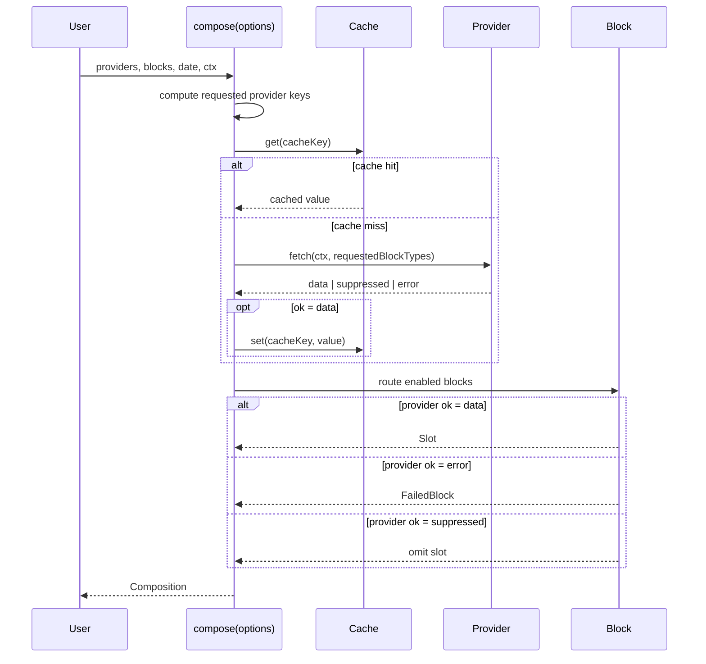

# Provider subsystem

## Purpose

A **provider** is the unit of async data acquisition in `pressedslip`. It fetches external data (weather, database rows, static config, fixture pools) and delivers it to one or more blocks inside a `compose()` run. Every provider carries a stable string `key`, a `scope`, a `freshness` policy, an optional per-provider `timeoutMs`, and a `fetch()` method that returns a discriminated `ProviderResult<T>`.

### Role in `compose()`

`compose()` runs an 8-step pipeline. Steps 3–5 are the provider lifecycle:

1. **(Step 3) Compute requested providers** — the orchestrator walks every enabled block and collects the union of `block.dependencies` keys. Only the keys needed by at least one enabled block in this run are fetched.
2. **(Step 4) Fetch providers** — all requested providers are dispatched with `Promise.all` (fully parallel). Each dispatch: checks the shared cache first, wraps the `provider.fetch()` call in `withTimeout`, and stores a successful result back into the cache. The outcome of each fetch — `"data"`, `"suppressed"`, or `"error"` — is recorded in `Composition.providerOutcomes`.
3. **(Step 5) Render enabled blocks** — blocks are routed to a `Slot` or `FailedBlock` based on the outcomes from step 4. A block whose provider returned `"error"` becomes a `FailedBlock` (with `failedProvider` set). A block whose provider returned `"suppressed"` is silently omitted (no `FailedBlock` entry). A block whose provider returned `"data"` proceeds to render.

The `Composition` returned by `compose()` is the complete audit trail: `providerOutcomes` carries every fetched provider's key, `ok` status, `durationMs`, `cacheHit` flag, and error `reason` (when applicable). `failedBlocks` records every block that did not produce a slot, including which provider caused the failure.

A `Provider` has no lifecycle beyond a single `compose()` call. There is no warm-up, no background refresh, and no cross-run state managed by the library. Cache persistence across runs is the consumer's responsibility via `ComposeOptions.cache`.

---

## Canonical diagram



The sequence shows: all providers dispatched in parallel, Provider A returning a cache hit, Provider B fetching and storing a new result, Provider N encountering a timeout and producing a fail-soft `"error"` outcome. Blocks that depended on Provider N appear in `failedBlocks`; all other blocks render normally.

---

## Invariants

The following invariants are enforced by the implementation. They are not aspirational — each one is backed by a specific code path in `src/orchestrator/compose.ts`.

### I1 — Providers are fetched in parallel; result order is submission order

`fetchProviders()` dispatches all requested provider keys with a single `Promise.all`. The array fed to `Promise.all` is built from `Array.from(requestedKeys)`, which is insertion-order stable in V8. The `outcomes` and `providerData` maps are populated from the settled results in the same iteration order. Neither the fetch phase nor the render phase imposes any sequential dependency between providers.

### I2 — Cache key is scoped to (providerKey, scope, freshness, date[, hour])

`deriveCacheKey()` in `src/orchestrator/cache-key.ts` returns:

```
<providerKey>:<scopePart>:<freshnessPart>
```

where `scopePart` is `ctx.subjectId` for `"personal"` providers or `"shared"` for `"shared"` providers, and `freshnessPart` is `ctx.date` for `"per-day"`, `"<date>T<HH>"` for `"per-hour"`, `"static"` for `"never"`, and `null` (cache entirely skipped) for `"always-fetch"`.

Two `compose()` calls with the same provider, same date, and different `subjectId` values produce different cache keys and therefore different cache entries. There is no cross-subject cache contamination. Two calls with different `date` values also produce different keys for `"per-day"` providers.

### I3 — `"always-fetch"` providers are never cached

`deriveCacheKey()` returns `null` for `freshness: "always-fetch"`. The cache lookup and cache write in `fetchProviders()` are both guarded by `if (cacheKey !== null)`. Such providers call `fetch()` on every `compose()` run, unconditionally.

### I4 — Provider timeout produces `"error"`, not a stale value

**This is the invariant directly relevant to the bug scenario ("provider times out but downstream blocks render with stale cache").**

When `provider.fetch()` exceeds its timeout, `withTimeout` rejects with a `TimeoutError`. Inside `fetchProviders()`, this rejection is caught by:

```ts
} catch (thrown) {
  if (isProgrammerError(thrown)) throw thrown;
  result = { ok: "error", reason: toSerializableError(thrown as Error) };
}
```

`TimeoutError` is not a programmer error, so it is converted to `{ ok: "error", reason: { name: "TimeoutError", ... } }`. The `if (result.ok === "data" && cacheKey !== null)` cache-write guard is never reached for an error result — **the cache is not written on timeout**. The `providerData` map only receives an entry when `result.ok === "data"`:

```ts
if (result.ok === "data") providerData[key] = result.value;
```

Downstream blocks receive their data exclusively from `providerData`. A timed-out provider has no entry in `providerData`. In `renderEnabledBlocks()`, any block with a dependency on that provider finds `providerOutcomes[dep].ok === "error"` and is routed to `failedBlocks` — **it does not render with a stale value**.

A stale value from a previous run can only appear if the consumer passes a persistent `Cache` instance (via `ComposeOptions.cache`) that still holds an entry for this provider from an earlier successful run. In that scenario, `cacheHit: true` is recorded on `ProviderOutcome` and the cached value is used. This is correct caching behavior, not a bug. The orchestrator's default cache (`createMemoryCache`) is ephemeral — it is created fresh per `compose()` call when `options.cache` is omitted and has no prior entries.

**To confirm whether a specific "stale cache" incident is a real bug or expected behavior:** check `composition.providerOutcomes[providerKey].cacheHit`. If `true`, the value came from the consumer-supplied cache — not from a live fetch or a timeout fallback. If `false` and `ok === "error"`, the fetch failed or timed out and the block should be in `failedBlocks`.

### I5 — `"parallel-soft"` mode: one provider failure does not abort other providers

In `parallel-soft` mode (the default), `fetchProviders()` always completes the full `Promise.all` — no provider can abort the fetch of another. Blocks whose specific dependencies failed are recorded in `failedBlocks`; blocks whose dependencies all succeeded produce slots.

### I6 — `"parallel-hard"` mode: any provider error aborts all blocks

When `mode: "parallel-hard"` is set and any provider returns `"error"`, `hardAbort` is set to `true`. In `renderEnabledBlocks()`, the hard-abort branch fires first and routes **every** enabled block to `failedBlocks` with `reason.name === "HardModeAbort"`. This applies even to blocks whose own dependencies succeeded.

### I7 — Registry invariants enforced at construction time

`createProviderRegistry()` enforces two programmer-error invariants at construction, not at fetch time:

1. Every object key must equal `provider.key`.
2. No two entries may declare the same `provider.key`.

Both violations throw synchronously before any `compose()` call can succeed.

### I8 — `subjectId` and `hour` preconditions are validated before fetch

`compose()` validates its inputs in step 1 before any provider is fetched. If any provider has `scope: "personal"` and `ctx.subjectId` is absent or empty, `compose()` throws a programmer error. If any provider has `freshness: "per-hour"` and `ctx.hour` is not a number in 0–23, `compose()` throws a programmer error. A timed-out personal-scope provider will never have been cached under an empty `subjectId`.

---

## ADR cross-references

| ADR | Relevance |
|---|---|
| [ADR-0014](../adrs/0014-error-handling-and-no-silent-failures.md) | Establishes the "mode + always-record" principle: `failedBlocks` is always populated regardless of error mode; failure records are never silently dropped. Provider failures follow the same invariant at the orchestrator level. |
| [ADR-0008](../adrs/0008-quality-bar-never-rules.md) | "No silent failures" quality rule that motivated the always-record design. Provider timeouts surface as `"error"` entries, not as dropped blocks with no signal. |
| [ADR-0009](../adrs/0009-bounded-hybrid-migration.md) | The bounded-hybrid migration strategy; obligations M1, M4, M7, M8 (parity behaviors) cover provider-level orchestration. |
| [ADR-0011](../adrs/0011-public-api-shape.md) | Provider types (`ProviderDefinition`, `ProviderContext`, `ProviderResult`, `ProviderOutcome`) are part of the public API surface. |

---

## Code anchors

### `src/orchestrator/compose.ts`

The pipeline entry point. Steps 3–5 are provider-specific:

- `computeRequestedProviders()` (step 3) — collects the dependency union across enabled blocks. Exported for testing.
- `fetchProviders()` (step 4) — `Promise.all` dispatch, cache read/write, timeout wrapper, error capture, `parallel-hard` abort detection. Exported for testing.
- `renderEnabledBlocks()` (step 5) — routes each block to `Slot` or `FailedBlock` based on the outcomes map from step 4.

Key logic to read for the timeout/stale-cache scenario: lines 193–232 (the async per-provider closure inside `fetchProviders`). The `if (result.ok === "data" && cacheKey !== null)` guard on line 226 is the exact gate that prevents a timed-out result from being cached or passed to blocks.

### `src/providers/define-provider.ts`

Identity helper that infers `T` from the `fetch` return type. Returns the same `ProviderDefinition<T>` object unchanged. Exists solely for TypeScript type inference — there is no runtime transformation.

### `src/providers/registry.ts`

`createProviderRegistry()`. Enforces the two key-consistency invariants at construction. Two passes: first checks for duplicate `provider.key` values, then checks that each registry object key matches its `provider.key`. Both violations throw before any `compose()` call can be made.

### Supporting files

| File | Role |
|---|---|
| `src/orchestrator/cache-key.ts` | `deriveCacheKey()` — deterministic key derivation per scope + freshness + ctx. Returns `null` for `"always-fetch"`. |
| `src/orchestrator/timeout.ts` | `withTimeout()` + `TimeoutError` — races a promise against a `setTimeout`, rejects with `TimeoutError` on expiry. |
| `src/orchestrator/cache.ts` | `createMemoryCache()` — default ephemeral in-memory cache; new instance per `compose()` call unless the consumer provides one via `ComposeOptions.cache`. |
| `src/types.ts` | `ProviderDefinition`, `ProviderContext`, `ProviderResult`, `ProviderOutcome`, `ComposeOptions`, `Cache`, `ReadOnlyCache`. |
