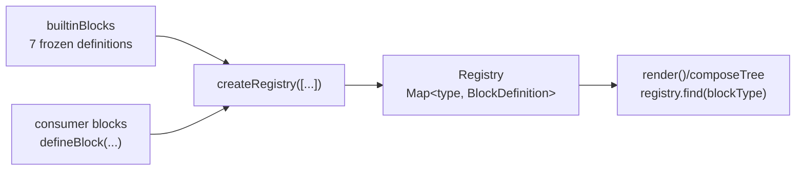

# Registry

## Purpose

The **block registry** is a lookup table that maps block type strings to their
`BlockDefinition` objects at render time. `createRegistry` is the only way to
produce one: it accepts a readonly array of `BlockDefinition` values, enforces
type-key uniqueness, and returns a frozen `Registry` object with O(1) lookup via
`find`, membership testing via `has`, stable enumeration via `list`, and a `size`
accessor.

This page covers `src/registry.ts` — the block registry only. pressedslip also
ships a separate provider registry (`src/providers/registry.ts`) built with
`createProviderRegistry`. The two registries serve different extension points:
the block registry holds render definitions; the provider registry holds data
source definitions. See the [provider architecture page](./provider.md) for
`createProviderRegistry`.

The central question this page answers for a maintainer: **why does adding a
block definition to my code not make it appear in `builtinBlocks`?** The answer
is in the Invariants section.

---

## Canonical diagram



---

## Invariants

### builtinBlocks is a static, sealed constant

`builtinBlocks` is a frozen array declared once in `src/index.ts`. It contains
exactly the seven visual-shape blocks that ship with the package:

```
keyValueBlock | kpiBlock | listBlock | qaPairBlock | quotationBlock | textCellBlock | wordSearchBlock
```

It is sealed with `Object.freeze` at module evaluation time. No call to
`createRegistry`, no import, and no runtime operation can add to or remove from
`builtinBlocks`. Its contents are determined at package-build time, not at
consumer call time.

### createRegistry does not modify builtinBlocks

`createRegistry([...builtinBlocks, myBlock])` creates a **new, independent
Registry instance** whose internal `Map` holds the union of the builtin
definitions and `myBlock`. The source array — including `builtinBlocks` itself —
is never mutated. After the call, `builtinBlocks` still has seven entries.
`createRegistry` reads from its input array; it does not write back to it.

### User-defined blocks live in the consumer's registry instance, not in builtinBlocks

The intended pattern:

```ts
import { builtinBlocks, createRegistry, defineBlock } from "pressedslip";
import { z } from "zod";

const weatherBlock = defineBlock({
  type: "weather",
  schema: z.object({ temp: z.number(), unit: z.string() }),
  render: ({ data }) => <div>{data.temp} {data.unit}</div>,
});

// Spread builtinBlocks and append your own block.
const registry = createRegistry([...builtinBlocks, weatherBlock]);

// registry.size === 8   (7 builtins + weatherBlock)
// builtinBlocks.length === 7   (unchanged)
```

`registry` is the value passed to `render()`. `builtinBlocks` is a convenience
constant that saves you from listing the seven builtin definitions manually; it is
not a mutable registry.

### Duplicate type keys throw at construction time

If two entries in the input array share the same `type` string, `createRegistry`
throws synchronously:

```
Error: Duplicate block type in registry: <type>
```

This is a programmer error, not a runtime policy. It fires during construction,
not during `render()`.

### The Registry interface is frozen and read-only

The object returned by `createRegistry` is not a class instance; it is a plain
object literal whose `list()` result is additionally frozen. Consumers cannot
attach properties to it or replace its methods. The `Registry` interface exposes
four members: `find`, `has`, `list`, `size`.

---

## Debugging the bug scenario: "Adding a block doesn't surface in builtinBlocks"

Root cause: the block was passed to `createRegistry`, which correctly registers
it in the returned `Registry` instance, but `builtinBlocks` was inspected
instead of the registry.

Work through these checks in order:

1. **Check the registry instance, not builtinBlocks.** Call
   `registry.has("myBlockType")` and `registry.size` on the value you passed to
   `render()`. Those reflect the full set of registered blocks. `builtinBlocks`
   will never contain a block you added at consumer call time — that is by design.

2. **Confirm the registry was built with the spread.** A common mistake is
   `createRegistry([myBlock])` instead of
   `createRegistry([...builtinBlocks, myBlock])`. The former registers only
   `myBlock`; the builtins are absent and will appear as unknown-type failures.

3. **Check failedBlocks for unknown-type entries.** If `Rendering.failedBlocks`
   contains an entry whose `reason.message` starts with `"Unknown block type:"`,
   the type string in the slot does not match any key in the registry passed to
   `render()`. This is the canonical symptom of a missing registration.

4. **Verify the type string matches exactly.** `registry.find` is a `Map.get`
   call — the lookup is case-sensitive and whitespace-sensitive.

---

## ADR cross-references

| ADR | Decision |
|-----|----------|
| [ADR-0011](../adrs/0011-public-api-shape.md) | `createRegistry` and `builtinBlocks` are both exported from the package root; each builtin block is also exported individually so consumers can partial-override the spread. |
| [ADR-0012](../adrs/0012-visual-shape-block-taxonomy.md) | Builtin blocks are visual-shape primitives only. Content-source blocks (weather, jokes, meals) belong in consumer-side `defineBlock` definitions, registered in a consumer-created registry instance. |

---

## Code anchors

| Symbol | File |
|--------|------|
| `createRegistry` | `src/registry.ts` |
| `builtinBlocks` | `src/index.ts` |
| `Registry` (interface) | `src/types.ts` |
| `createProviderRegistry` | `src/providers/registry.ts` |
