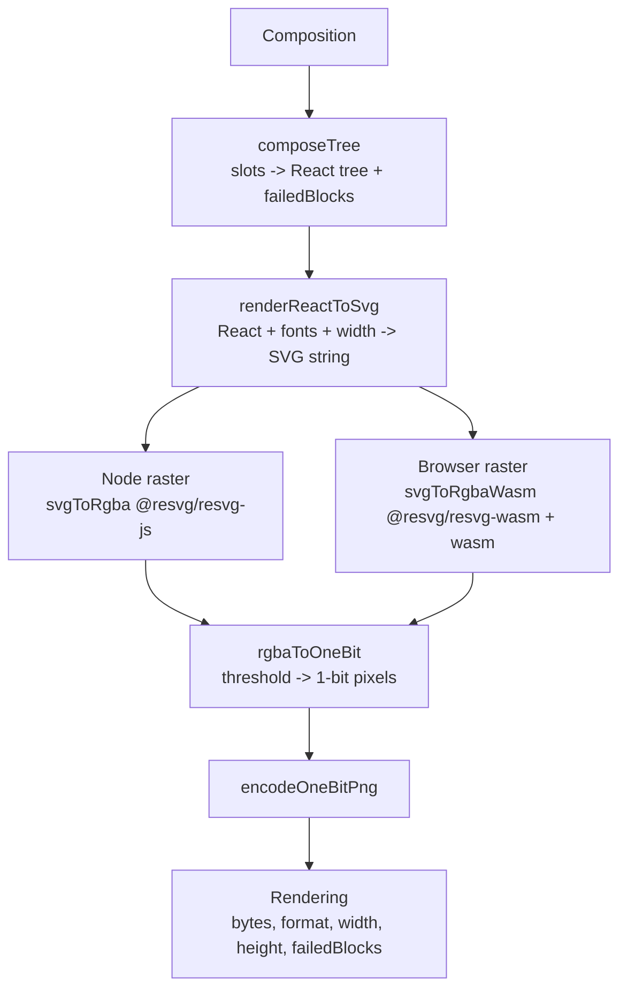

# Render pipeline

## Purpose

`render()` converts a `Composition` into a 1-bit PNG `Uint8Array` suitable for
thermal printing or in-browser preview. The pipeline has five sequential stages:

1. **`composeTree`** — walks `composition.slots`, validates each slot's data
   against its block definition's schema, calls `def.render()`, and wraps the
   result in a `BlockShell`. Produces a React element tree and a `failedBlocks`
   array. This stage is shared, code-identical, across both entry points.

2. **`renderReactToSvg` (Satori)** — converts the React element tree to an SVG
   string. Width is constrained to `widthPx` (default 576 px for thermal-80).
   Font data comes from the resolved `PreparedTheme` or the caller-supplied
   `fonts` array.

3. **SVG → RGBA rasterization** — the single stage that differs between entry
   points:
   - **Node path** (`src/render.tsx`): calls `svgToRgba` via
     `@resvg/resvg-js` (native `.node` addon).
   - **Browser path** (`src/browser/render.ts`): calls `svgToRgbaWasm` via
     `@resvg/resvg-wasm` (WebAssembly, caller-provided binary).

4. **`rgbaToOneBit`** — applies a luminance threshold (default 128) to produce
   a 1-bit-per-pixel buffer.

5. **`encodeOneBitPng`** — encodes the 1-bit buffer as a PNG `Uint8Array`
   returned in the `Rendering.bytes` field.

The two entry points are:

- **Node** — `import { render } from "pressedslip"` → `src/render.tsx`, backed
  by `@resvg/resvg-js`.
- **Browser** — `import { render } from "pressedslip/browser"` →
  `src/browser/render.ts`, backed by `@resvg/resvg-wasm`. Requires a
  `BrowserRenderOptions.wasm` binary supplied by the caller (no auto-detection).

For the `Composition` shape that `render()` consumes, see
[composition.md](./composition.md).

---

## Canonical diagram

---

## Invariants

The following properties must hold across all changes. Any fix to the browser or
Node path that would violate an invariant is a breaking change.

### Structural output is byte-identical Node vs Browser

The stages before and after rasterization are shared code:

- `composeTree` — identical call, identical module (`src/pipeline/compose-tree.tsx`)
- `renderReactToSvg` — identical call, identical module (`src/pipeline/satori-to-svg.ts`)
- `rgbaToOneBit` — identical call, identical module (`src/pipeline/one-bit.ts`)
- `encodeOneBitPng` — identical call, identical module (`src/pipeline/png-encode.ts`)

Consequently, the following outputs are byte-identical regardless of which entry
point is called, given the same `Composition`, `width`, `threshold`, and font data:

- `Rendering.failedBlocks` — contents, length, and order.
- `Rendering.width` and `Rendering.height` — pixel dimensions.
- `Rendering.format` — always `"png-1bit"`.
- The intermediate SVG string produced by `renderReactToSvg`.
- The 1-bit buffer produced by `rgbaToOneBit`.
- **The final `Rendering.bytes` PNG buffer** — byte-for-byte equal when the same
  font data and width are used (confirmed empirically by the determinism gate
  across the builtin block catalog, all `Buffer.equals` PASS).

This guarantee is grounded in the upstream `resvg` crate, which produces
pixel-identical output across x86, ARM, and WebAssembly:

> "If you render an SVG file on x86 Windows and then render it on ARM macOS,
> the produced image will be identical — each pixel will have the same value.
> This also extends to WebAssembly." — linebender/resvg README

Both packages are pinned to the same upstream release tag:
`@resvg/resvg-js@^2.6.2` and `@resvg/resvg-wasm@^2.6.2`.

### PNG pixel output is NOT expected to be byte-identical across host platforms

The byte-identical guarantee applies to `resvg-js` vs `resvg-wasm` on the
**same host platform**. It does not apply across platforms (macOS x86 vs Linux
ARM) or across different rasterizer implementations (resvg vs browser-native
`OffscreenCanvas`). Font hinting decisions, subpixel-antialiasing, and
platform-specific renderer internals can cause pixel-level differences that are
visually imperceptible but fail a byte-equality check.

This asymmetry is the expected normal condition, not a bug:

- A byte difference between Node and browser output that is NOT caused by
  differing fonts, differing width, or a divergence in the shared stages
  (composeTree, Satori, one-bit, PNG encoding) is **expected** and does not
  indicate an implementation defect.
- A structural difference — slot count, block dispatch order, `failedBlocks`
  contents, `width`, `height`, or `format` — is **never** expected and must be
  treated as a defect. The determinism gate (`tests/integration/render-engine-parity.test.ts`)
  enforces this on every CI run.

### `failedBlocks` is always present and always complete

`composeTree` produces a `failedBlocks` array regardless of the `onBlockError`
mode. An unknown block type or a schema-validation failure always produces a
`FailedBlock` entry; errors are never silently swallowed. The `Rendering`
returned by either `render()` function always carries `failedBlocks`, even when
empty. (ADR-0014.)

### Wasm init is cached at module scope

The first call to the browser `render()` pays the wasm boot cost (~50–200 ms).
Subsequent calls within the same module lifetime reuse the cached init promise.
The cache resets on init failure. This is a module-scope guarantee; test
isolation that requires a fresh wasm init must reload the module.

### `BrowserRenderOptions.wasm` is required; there is no environment sniffing

The browser entry point never attempts to locate or load the wasm binary
automatically. The caller must supply a `WasmInput` (one of
`ArrayBufferView | ArrayBuffer | Response | Promise<Response>`). This avoids
bundler-specific magic inside the library. (ADR-0018.)

---

## ADR cross-references

| ADR | Relevance |
|---|---|
| [ADR-0011: Public API shape](../adrs/0011-public-api-shape.md) | Defines `render`, `BrowserRenderOptions`, and `Rendering` as named public exports from the root barrel and the `/browser` subpath. |
| [ADR-0013: WidthSpec and paper](../adrs/0013-widthspec-and-paper.md) | Documents `PAPER.thermal80` (576 px) as the default width and the `resolveWidth` contract used by both render entry points. |
| [ADR-0014: Error handling and no-silent-failures](../adrs/0014-error-handling-and-no-silent-failures.md) | Mandates that `failedBlocks` is always present and never suppressed by error-mode options. |
| [ADR-0017: Font loader fetch-only](../adrs/0017-font-loader-fetch-only.md) | Governs `loadThemeFonts` (used inside both render paths for `ThemeTemplate` resolution) and the browser-safe fetch constraint. |
| [ADR-0018: Browser render via resvg-wasm + byte-identical determinism gate](../adrs/0018-browser-render-resvg-wasm.md) | The primary ADR. Establishes the wasm DI contract, the module-scope init cache, the byte-identical guarantee, and the determinism gate. Defines the circuit-breaker procedure if the gate ever fails. |
| [ADR-0019: /browser barrel full re-export](../adrs/0019-browser-barrel-full-re-export.md) | Explains why `src/browser/index.ts` re-exports `createRegistry` and builtin block definitions directly from source modules (not through `src/index.ts`) to avoid transitively pulling `@resvg/resvg-js` into the browser bundle. |

---

## Code anchors

| Symbol | File | Description |
|---|---|---|
| `render` | `src/render.tsx` | Node entry point. Orchestrates the full pipeline: `composeTree` → `renderReactToSvg` → `svgToRgba` (resvg-js) → `rgbaToOneBit` → `encodeOneBitPng`. |
| `render` | `src/browser/render.ts` | Browser entry point. Mirrors `src/render.tsx` exactly, with `svgToRgbaWasm` in place of `svgToRgba`. Diverges only at line 99. |
| `BrowserRenderOptions` | `src/browser/render.ts` | Extends `RenderOptions` with the required `wasm: WasmInput` field. |
| `composeTree` | `src/pipeline/compose-tree.tsx` | Shared stage 1. Walks `composition.slots`, validates data, calls `def.render()`, wraps output in `BlockShell`. Produces the React element tree and `failedBlocks` array. |
| `renderReactToSvg` | `src/pipeline/satori-to-svg.ts` | Shared stage 2. Calls Satori to convert the React tree to an SVG string at the given width with the supplied fonts. |
| `svgToRgba` | `src/pipeline/svg-to-bitmap.ts` | Node-only stage 3. Rasterizes the SVG string to an RGBA buffer using `@resvg/resvg-js`. |
| `svgToRgbaWasm` | `src/pipeline/svg-to-bitmap-wasm.ts` | Browser stage 3. Rasterizes the SVG string to an RGBA buffer using `@resvg/resvg-wasm`. Manages the module-scope init cache. Zero `node:*` imports. |
| `rgbaToOneBit` | `src/pipeline/one-bit.ts` | Shared stage 4. Applies luminance threshold to produce a 1-bit-per-pixel buffer. |
| `encodeOneBitPng` | `src/pipeline/png-encode.ts` | Shared stage 5. Encodes the 1-bit buffer as a PNG `Uint8Array`. |
| `render-engine-parity` | `tests/integration/render-engine-parity.test.ts` | Determinism gate. Renders builtin shapes through both engines; asserts `Buffer.equals` on the final PNG. Runs in `pnpm test`; failure halts CI. |

---

## Debugging: "browser render produces different output from Node render"

Use the invariant table above to locate the divergence.

**Structural difference** (slot count, `failedBlocks` contents, `width`, `height`,
`format` differ):

This is always a defect. The shared stages (`composeTree`, `renderReactToSvg`,
`rgbaToOneBit`, `encodeOneBitPng`) are code-identical. A structural difference
means one of these shared stages is no longer shared — check for accidental
import drift between `src/render.tsx` and `src/browser/render.ts`. The
determinism gate (`tests/integration/render-engine-parity.test.ts`) should have
caught this on CI; verify the gate is passing.

**Pixel-level difference** (PNG bytes differ but structure is identical):

This is expected behavior when comparing across platforms or rasterizer
implementations. When comparing `resvg-js` vs `resvg-wasm` on the same platform,
byte equality is the expectation — if the determinism gate is PASS and a
consumer still observes a difference, check:

1. Font data — are both paths receiving exactly the same `PreparedTheme` or
   `fonts` array? A mismatch in `loadThemeFonts` output (e.g., CDN fetch
   returning a different font binary on one path) produces different SVG metrics
   and therefore different pixels.
2. Width — are both paths using the same `width` option? A default-resolved
   width difference produces a different RGBA buffer.
3. Threshold — are both paths using the same `threshold` value?

If fonts, width, and threshold all match and byte equality is still absent,
follow the ADR-0018 circuit-breaker procedure: capture the diverging shape,
byte lengths, and first diff offset, then consult the gate fallback documented
in ADR-0018 §"Determinism gate fallback".
