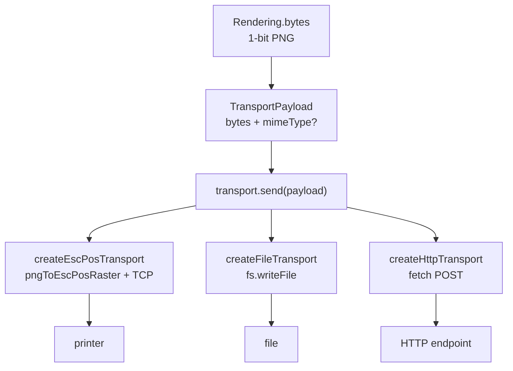

# Transport

## Purpose

A Transport is the output boundary of the render pipeline. Where `render()` produces a PNG `Uint8Array`, a Transport consumes that byte array (plus an optional `mimeType` field) and performs a side effect: it sends the bytes to a device, writes them to a file, or POSTs them to an endpoint. The package ships three reference transports — `createEscPosTransport`, `createFileTransport`, and `createHttpTransport` — and a public `Transport` interface that consumers implement to add any custom destination.

**The rendering/transport boundary is strict.** The render pipeline has no knowledge of how bytes will be delivered; a Transport has no knowledge of how bytes were produced. A `Transport` receives a `TransportPayload`:

```ts
interface TransportPayload {
  readonly bytes: Uint8Array;
  readonly mimeType?: string; // defaults to "image/png" at each transport's send() entry-point
}
```

and calls `send()`:

```ts
interface Transport {
  send(payload: TransportPayload): Promise<void>;
}
```

`send()` is fire-and-forget: it resolves on success, rejects on failure. Every rejection attaches a stable `code: string` field for retriability classification. Programmer errors (`TypeError`, `ReferenceError`, and non-`Error` throws) are not caught — they propagate unmodified per ADR-0014.

All three reference transports are Node-only. The `/transports` subpath is excluded from the `/browser` bundle by design. `scripts/verify-browser-bundle.mjs` enforces that no `node:*` import is transitively reachable from `dist/browser/index.mjs`; `/transports` does import `node:*` and is intentionally absent from that path.

---

## Canonical diagram



---

## Invariants

The implementation must preserve all of the following. Any fix that would violate one of these is a breaking change.

- **`mimeType` default is applied at each transport's `send()` entry-point, not at the caller.** When `payload.mimeType` is `undefined`, each transport substitutes `"image/png"` before any transport-specific validation. The `TransportPayload` type marks `mimeType` as optional for this reason; callers may omit it.

- **`send()` rejects with a tagged `Error`, never with a non-`Error` value.** Every operational failure throws an `Error` whose `.code` string property is a stable, documented machine-readable code. Node-native error codes (`ECONNREFUSED`, `ENOSPC`, `EACCES`, etc.) are preserved as-is; synthesized codes are named in all-caps snake-case and documented on each factory's TSDoc `@throws` list.

- **Programmer errors are never caught.** `TypeError`, `ReferenceError`, and any non-`Error` throw propagate out of `send()` uncaught. Operational errors (network failures, disk full, unreachable host) are caught and rethrown with a `code` tag. This distinction is from ADR-0014.

- **The ESC/POS transport targets Epson-dialect ESC/POS only.** The `createEscPosTransport` implementation emits `ESC @` (init), `ESC 2` (line spacing), `GS v 0` raster header, 1-bit MSB-first row-major packed bitmap, optional `ESC d` feed, and optional `GS V 0` full cut. These are standard Epson-dialect ESC/POS commands. **Star printers (and Citizen, Bixolon, and other brands) use a different command dialect often called StarPRNT; that dialect is NOT supported by the builtin `createEscPosTransport`.** If you see garbage output on a Star printer, this is the expected result of a dialect mismatch, not a bug in the raster helper. Consumers on non-Epson hardware must author a custom `Transport` that emits the correct command set for their device. The `Transport` interface and `pngToEscPosRaster` helper are both public for this purpose.

- **ESC/POS raster constraints are enforced before any TCP write.** PNG width must equal `PRINT_WIDTH_DOTS` (576). PNG height must be in `1..PRINT_MAX_HEIGHT_DOTS` (4096). Compressed PNG byte size must be ≤ `MAX_COMPRESSED_BYTES` (10 MiB). Violations throw before the socket is opened. These constraints are derived from the printable area of a standard 80 mm thermal printer at 203 dpi; see ADR-0013.

- **ESC/POS TCP delivery is ACK-less by protocol.** A successful `socket.end()` flush confirms the printer's TCP stack accepted the bytes; it does NOT confirm the printer received or printed them. Callers requiring delivery confirmation must implement application-level polling (e.g., printer status endpoint) above this transport. There is no higher-level delivery guarantee available without printer vendor cooperation.

- **The file transport does not wrap Node `fs` errors.** `createFileTransport` re-throws `fs.writeFile` rejections as-is, preserving the original Node-native `error.code` (`EACCES`, `ENOSPC`, `ENOENT`, `EISDIR`). Path confinement is the caller's responsibility.

- **The HTTP transport always validates scheme and strips userinfo.** `createHttpTransport` rejects URLs with any scheme other than `http:` or `https:` with `code = "HTTP_INVALID_SCHEME"`. Userinfo (username, password) is stripped from the URL before the `fetch` call and before any `allowedHosts` origin match. These guards run on every `send()` call, not only at factory time.

- **`allowedHosts` origin matching is exact.** An `allowedHosts` entry must be a full origin string of the form `"scheme://host:port"`. The origin of the request URL is derived as `scheme://hostname:port` with the default port filled in for `http:` (80) and `https:` (443). A mismatch rejects with `code = "URL_NOT_ALLOWED"`. Omitting `allowedHosts` skips the check but emits a once-per-process `console.warn`; set `PH_DISABLE_SSRF_WARNING=1` to suppress the warning in test environments.

- **`feedLines` must be an integer in 0..255.** The ESC/POS factory validates `feedLines` at construction time (before any `send()` call) and throws `code = "INVALID_CONFIG"` on violation. `0` disables the feed command entirely; values outside 0–255 are rejected because the `ESC d` command encodes the line count in a single byte.

---

## ADR cross-references

| ADR | Relevance |
|---|---|
| [ADR-0005: Node baseline >=22.11](../adrs/0005-node-baseline-22.md) | The `/transports` subpath relies on `node:net` (TCP socket) and `node:fs/promises`; Node 22 is the minimum supported version. |
| [ADR-0011: Public API shape](../adrs/0011-public-api-shape.md) | Establishes `/transports` as a named subpath export; the `Transport` interface and three reference factories are the committed public surface. |
| [ADR-0013: WidthSpec and PAPER presets](../adrs/0013-widthspec-and-paper.md) | Fixes `PRINT_WIDTH_DOTS` at 576 — the printable pixel width of an 80 mm thermal roll at 203 dpi. The ESC/POS raster constraint (`width === 576`) is a direct consequence of this decision. |
| [ADR-0014: Error handling and no-silent-failures](../adrs/0014-error-handling-and-no-silent-failures.md) | Mandates that all operational failures throw with a `code` tag and that programmer errors are never caught. All three reference transports implement this contract. |

---

## Code anchors

The symbols below are the entry points for reading and modifying the transport subsystem. Open them in this order when tracing a delivery failure.

| Symbol | File | Description |
|---|---|---|
| `Transport` | `src/transports/types.ts` | The interface every transport implements. One method: `send(payload): Promise<void>`. |
| `TransportPayload` | `src/transports/types.ts` | Byte-plus-metadata argument to `send()`. `mimeType` defaults to `"image/png"` if absent. |
| `transportError` | `src/transports/types.ts` | Public factory for tagged `Error` instances. Accepts a `code` string, human message, and optional `cause`. Use this when authoring a custom `Transport`. |
| `createEscPosTransport` | `src/transports/escpos.ts` | Factory for the TCP thermal printer transport. Validates `feedLines` at construction time. `send()` calls `pngToEscPosRaster`, composes the trailer, opens a `node:net` `Socket`, writes all bytes, then destroys the socket. |
| `pngToEscPosRaster` | `src/transports/escpos.ts` | Pure helper (exported separately). Decodes a PNG via `fast-png`, packs pixels to 1-bit MSB-first row-major, and prepends the `ESC @ ESC 2 GS v 0` header. Does NOT include feed or cut bytes — those are appended by the transport layer. |
| `createFileTransport` | `src/transports/file.ts` | Factory for the filesystem transport. `send()` delegates to `fs.writeFile`; native error codes are not wrapped. |
| `createHttpTransport` | `src/transports/http.ts` | Factory for the HTTP POST transport. Always-on scheme guard and userinfo strip; opt-in `allowedHosts` origin matching; `AbortController`-based timeout. |
| `PRINT_WIDTH_DOTS` | `src/transports/constants.ts` | `576` — enforced by `pngToEscPosRaster`. The renderer must produce images at this exact width for ESC/POS output. |
| `PRINT_MAX_HEIGHT_DOTS` | `src/transports/constants.ts` | `4096` — maximum height enforced by `pngToEscPosRaster`. Approximately 80 cm of paper at 203 dpi. |
| Barrel | `src/transports/index.ts` | Re-exports all public symbols: `Transport`, `TransportPayload`, `transportError`, the three factories, `pngToEscPosRaster`, and the five constants. Import path: `"pressedslip/transports"`. |

---

## Debugging guide: "Star printer prints garbage"

This is the expected outcome when the Epson-dialect ESC/POS command stream reaches a printer that speaks StarPRNT or another vendor dialect. The builtin `createEscPosTransport` emits Epson-specific commands that Star printers do not interpret the same way.

**Steps to verify and fix:**

1. **Confirm the dialect mismatch.** Check your printer's model number. Star Micronics, Citizen, Bixolon, and similar brands use their own command dialects that are not command-for-command compatible with Epson ESC/POS. The `GS v 0` raster command used by this package is an Epson-dialect command; Star printers use a different raster mechanism.

2. **The fix is a custom Transport.** Implement the `Transport` interface with a `send()` that emits the correct command set for your printer. Use `pngToEscPosRaster` as a reference for PNG decoding and 1-bit pixel packing — those steps are printer-vendor-neutral. Replace the header and trailer bytes with your printer's commands.

3. **The interface to copy is `Transport` in `src/transports/types.ts`.** One method: `send(payload: TransportPayload): Promise<void>`. Throw with `transportError(code, message, cause)` for operational failures so callers can inspect `err.code`.

4. **Verify PNG dimensions before writing any bytes.** Your custom transport will likely need the same dimension guards as `pngToEscPosRaster`: `PRINT_WIDTH_DOTS` (576) for width and `PRINT_MAX_HEIGHT_DOTS` (4096) for height. Import these constants from `"pressedslip/transports"`.
