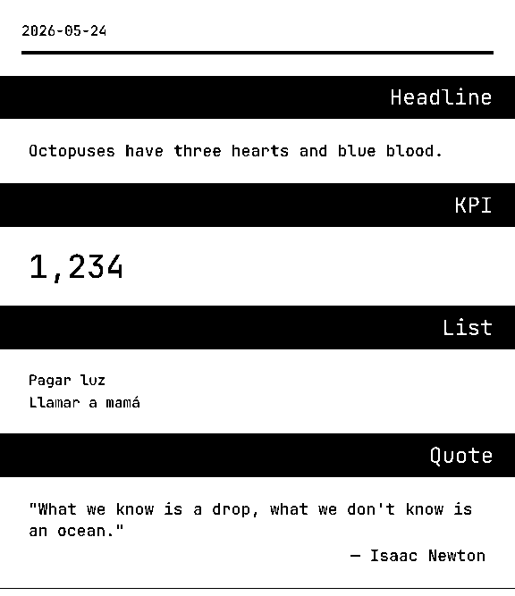

# Getting Started

Render your first printable composition in a few minutes.

## Install

```bash
pnpm add pressedslip
# or: npm install pressedslip
# or: yarn add pressedslip
```

## Your First Render

Create `render-briefing.ts`:

```ts
import { writeFile } from "node:fs/promises";
import {
  PAPER,
  builtinBlocks,
  createRegistry,
  loadThemeFonts,
  render,
  themes,
} from "pressedslip";

const registry = createRegistry(builtinBlocks);
const theme = await loadThemeFonts(themes.default);

const composition = {
  id: "daily-briefing",
  version: 1,
  date: "2026-06-08",
  status: "ready",
  slots: [
    {
      index: 0,
      blockType: "textCell",
      title: "Daily Briefing",
      data: { text: "Your first printable composition" },
    },
    {
      index: 1,
      blockType: "kpi",
      title: "System",
      data: { label: "Uptime", value: "99.9%" },
    },
    {
      index: 2,
      blockType: "list",
      title: "Quick Notes",
      data: {
        groups: [
          {
            items: [
              { value: "pressedslip renders to 1-bit PNG" },
              { value: "Use pressedslip/browser for browser rendering" },
              { value: "Use pressedslip/transports for delivery" },
            ],
          },
        ],
      },
    },
  ],
  failedBlocks: [],
  providerOutcomes: {},
  timing: { totalMs: 0, fetchPhaseMs: 0, renderPhaseMs: 0 },
};

const { bytes } = await render(composition, {
  registry,
  theme,
  width: PAPER.thermal80,
});

await writeFile("briefing.png", bytes);
console.log("Rendered briefing.png");
```

Run it:

```bash
npx tsx render-briefing.ts
```

Open `briefing.png`. You should see a receipt-style document with three blocks.



## What You Did

1. **Created a registry**: `createRegistry(builtinBlocks)` registers the seven builtins: `textCell`, `keyValue`, `kpi`, `list`, `qaPair`, `quotation`, and `wordSearch`.
2. **Prepared a theme**: `loadThemeFonts(themes.default)` fetches TTF/OTF font bytes with global `fetch`.
3. **Defined a composition**: `slots[]` is ordered data. Each slot names a `blockType`, optional `title`, and block-specific `data`.
4. **Rendered to PNG**: `render()` returns `{ bytes, format, width, height, failedBlocks }`.
5. **Wrote the file**: `bytes` is a `Uint8Array` containing a 1-bit PNG.

## Next Steps

- For local font files in Node, read bytes with `node:fs/promises` and pass them to `loadFontFromBuffer`.
- Use [Themes](themes.md) to customize typography and shell styles.
- Use [Providers](providers.md) when blocks need API/database/sensor data before rendering.
- Use [Browser Rendering](browser-rendering.md) for `pressedslip/browser`.
- Use [Transports](transports.md) to send PNG bytes to ESC/POS, file, or HTTP destinations.
- Use [Testing](testing.md) for structural assertions instead of PNG byte snapshots.

## Blocks

Every slot references a block type. The package includes:

- **`textCell`**: single text body with optional alignment.
- **`keyValue`**: key-value rows for compact facts.
- **`kpi`**: large value with optional label and caption.
- **`list`**: flat or grouped lists.
- **`qaPair`**: question and answer content.
- **`quotation`**: quotation body with optional attribution.
- **`wordSearch`**: fixed letter grid with hidden words.

Start with the [block guides](../blocks/text-cell.md) for exact data shapes and design notes.

## Determinism Caveat

PNG output is not byte-identical across operating systems, Node versions, or Bun versions. Font rasterizers can differ. In tests, assert structure and failures rather than raw PNG buffers:

```ts
import { assertNoFailedBlocks } from "pressedslip/testing";

const rendering = await render(composition, { registry, theme: themes.default });
assertNoFailedBlocks(rendering, { expect });
```

## API Reference

Run `pnpm docs:api` to generate TypeDoc HTML into `docs/api/reference/`. The generated HTML is local build output and is not committed.
