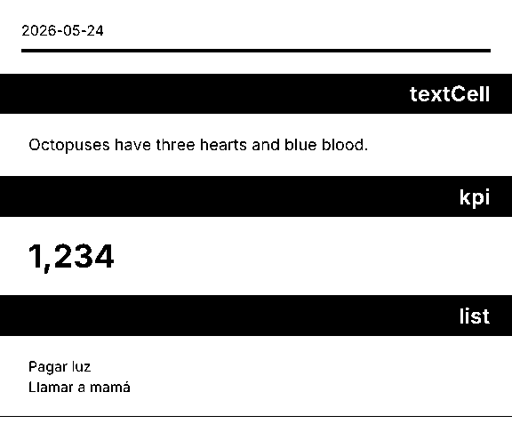
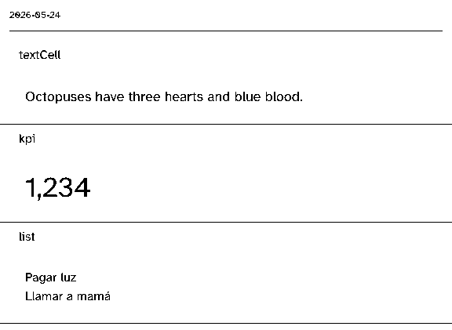
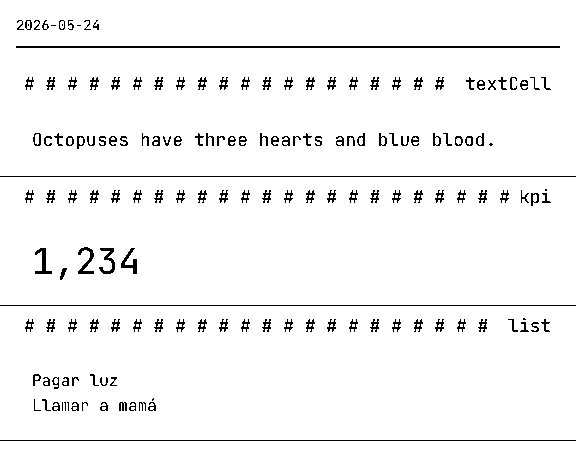

# Themes

A theme is a cohesive visual identity for your receipt. It bundles a **font stack** with **shell styling** (the title strip, header layout, block separators, spacing). You customize the look by applying a builtin theme, tweaking it to your needs, or writing a custom one from scratch.

Themes do NOT control block internals — the visual voice of a block (e.g., KPI's uppercase eyebrow, italic quotations, 36px display value) lives inside the block definition. If you want a different block aesthetic, fork it with `defineBlock`.

The snippets below assume you already have a current `Composition` object named
`composition`.

## Pick a builtin theme

Three ready-to-use themes ship with the package:

- **`default`** — Modern, clean, readable. Inter sans-serif. Inverted black title bars.
- **`mono`** — Developer notebook aesthetic. JetBrains Mono. Hash-fill title style.
- **`compact`** — Hyperlegible, dense. Atkinson Hyperlegible. Plain text titles.

Here's how each looks:







### Apply a builtin theme

```ts
import { builtinBlocks, createRegistry, render, themes } from "pressedslip";

const registry = createRegistry(builtinBlocks);
const { bytes } = await render(composition, {
  registry,
  theme: themes.default,
});
```

The first render fetches fonts from CDN and caches them internally. Subsequent renders hit the cache — no delay.

## Override a theme

Start with a builtin and tweak specific properties. For example, adjust padding, font sizes, or title alignment:

```ts
import { builtinBlocks, createRegistry, themes, render } from "pressedslip";

const registry = createRegistry(builtinBlocks);

// Use default as base, but increase spacing and make titles left-aligned
const customized = {
  ...themes.default,
  shell: {
    ...themes.default.shell,
    titleAlignment: "left",
    contentPadding: "loose",
  },
  header: {
    ...themes.default.header,
    nameFontSize: 36,
    padding: 32,
  },
};

const { bytes } = await render(composition, { registry, theme: customized });
```

## Write a custom theme

If you need a completely custom look (e.g., corporate branding, custom font family), define a theme from scratch:

```ts
import { builtinBlocks, createRegistry, defineTheme, render } from "pressedslip";

const registry = createRegistry(builtinBlocks);

const brandTheme = defineTheme({
  id: "acme-2026",
  label: "ACME 2026 Brand",
  roleUrls: {
    body: [
      {
        family: "BrandSans",
        url: "https://cdn.example.com/brand-sans-400.ttf",
        weight: 400,
        style: "normal",
      },
      {
        family: "BrandSans",
        url: "https://cdn.example.com/brand-sans-700.ttf",
        weight: 700,
        style: "normal",
      },
    ],
    display: [
      {
        family: "BrandSans",
        url: "https://cdn.example.com/brand-sans-900.ttf",
        weight: 900,
        style: "normal",
      },
    ],
  },
  shell: {
    titleStyle: "block",
    titleFontRole: "display",
    titleAlignment: "left",
    titleBg: "#003366",
    titleFg: "#fff",
    contentPadding: "normal",
    separatorThickness: "thin",
  },
  header: {
    nameFontRole: "display",
    nameFontSize: 40,
    nameFontWeight: 900,
    padding: 24,
    bottomRuleHeight: 4,
  },
});

const { bytes } = await render(composition, { registry, theme: brandTheme });
```

All themes must declare at least a `body` role in `roleUrls`. Optional roles include `mono`, `display`, and any custom names you pass to `extraUrls`. Blocks look up title fonts via `titleFontRole` — it resolves to a role in `roleUrls` or `extraUrls`.

## Title strip styles

The `shell.titleStyle` field controls how block titles render:

- **`"block"`** — Inverted bar with background color (titleBg / titleFg), full width, padding 8px 24px. Used by `default`.
- **`"hash"`** — Text on white, filled left to right with `titleFillChar` (default `"#"`). Used by `mono`.
- **`"plain"`** — Text on white, no inversion, optional alignment. Used by `compact`.

## Font format

**Fonts must be TTF or OTF.** The underlying renderer (Satori) cannot parse WOFF2. If your font source defaults to WOFF2 (e.g., Google Fonts web interface), use the static TTF endpoint instead:

```ts
// ❌ Don't use: https://fonts.google.com/?query=inter (defaults to WOFF2)

// ✅ Do use: Direct TTF from gstatic
url: "https://fonts.gstatic.com/s/inter/v20/UcCO3FwrK3iLTeHuS_nVMrMxCp50SjIw2boKoduKmMEVuLyfMZg.ttf"

// ✅ Also works: jsDelivr CDN
url: "https://cdn.jsdelivr.net/npm/@fontsource/inter@5/files/inter-latin-400-normal.ttf"
```

## Pre-load fonts for batch renders

If you're rendering the same theme many times (e.g., a scheduled job that produces 100 briefings), load fonts once and reuse:

```ts
import { builtinBlocks, createRegistry, themes, loadThemeFonts, render } from "pressedslip";

const registry = createRegistry(builtinBlocks);

// Load fonts once
const prepared = await loadThemeFonts(themes.mono);

// Reuse across renders
for (const composition of compositions) {
  const { bytes } = await render(composition, { registry, theme: prepared });
}
```

## Font caching strategies

By default, fonts are cached in memory per process. For Node scripts and batch jobs, you can persist the cache to disk:

```ts
import { builtinBlocks, createRegistry, themes, loadThemeFonts, render } from "pressedslip";
import { nodeFontCache } from "pressedslip/providers";

const registry = createRegistry(builtinBlocks);
const cache = nodeFontCache({ dir: "./font-cache" });
const prepared = await loadThemeFonts(themes.mono, { cache });

// Fonts are now saved to ./font-cache/ and reused across script runs
for (const comp of compositions) {
  const { bytes } = await render(comp, { registry, theme: prepared });
}
```

Cache options:

- **Default** (`undefined`) — in-memory only. Fast, per-process.
- **`memoryFontCache()`** — explicit in-memory cache. Useful for tests needing fresh state.
- **`nodeFontCache({ dir? })`** (Node only) — disk cache. Defaults to `~/.cache/pressedslip-fonts/`. Survives script restarts.

## What themes cannot do

By design, themes do NOT control:

- **Block internals** — opacity, lineHeight, letterSpacing, textTransform, fontStyle. These are block voice, not theme responsibility.
- **Semantic structure** — slot order, block data shapes.
- **Block-specific font sizes** — e.g., KPI's 36px display value, eyebrow 14px, caption 12px.

For these, define a custom block with `defineBlock`.
