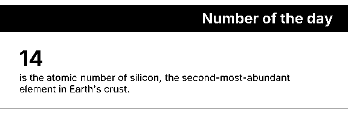
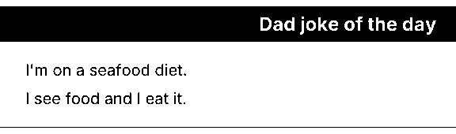
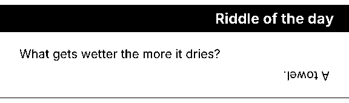
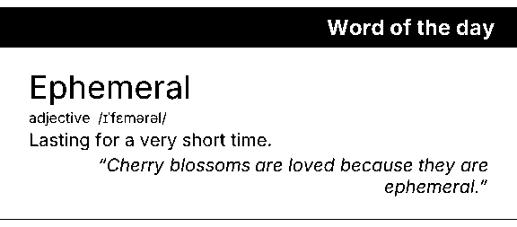
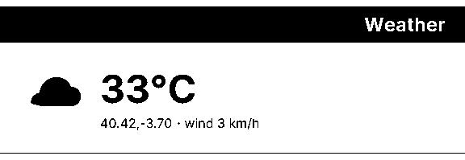

# Examples

Five end-to-end recipes that show how to compose a `pressedslip` slip: a
**generator** (corpus or live API) produces today's data, then a **render**
turns it into a 1-bit PNG.

Each folder ships two variants of the same recipe:

- **`.ts` / `.tsx`** — Node entrypoint. Writes `./output.png` via the root
  `pressedslip` package. Run with `pnpm example:<name>`.
- **`.html`** — Browser entrypoint. Loads `pressedslip/browser` via `esm.sh`,
  renders client-side with `@resvg/resvg-wasm`, auto-runs on page load.
  Open the file directly — no build step, no server.

| Example | Block Type | Key technique | Preview |
|---|---|---|---|
| [`number-fact/`](./number-fact/) | `kpi` | The minimal recipe — corpus pick → built-in block → render. |  |
| [`dad-joke/`](./dad-joke/) | `qaPair` | Same shape as `number-fact` with a different built-in block + a day-of-year picker for >31-item corpora. |  |
| [`riddle/`](./riddle/) | `qaPair` + theme override | `defineTheme` overriding `shell.textStyles.answer.rotate = 180` so the answer renders upside-down — the reader has to flip the paper. Achieved by theme override. |  |
| [`word-of-day/`](./word-of-day/) | Custom block via `defineBlock` | Multi-slot custom block + extending `roleUrls.body` with an Inter italic 400 face so `fontStyle: "italic"` actually slants (Satori silently falls back to upright without the matching face loaded). |  |
| [`weather/`](./weather/) | Custom block + inline SVG icon | Live Open-Meteo fetch with 5s `AbortController` timeout and hardcoded fallback. Inline `<svg>` inside the block render — Satori serializes `<svg>` natively; `` is NOT supported. |  |

## Running

```sh
pnpm example:number-fact
pnpm example:dad-joke
pnpm example:riddle
pnpm example:word-of-day
pnpm example:weather
pnpm example:all
```

In the browser: open any `example.html` directly.
